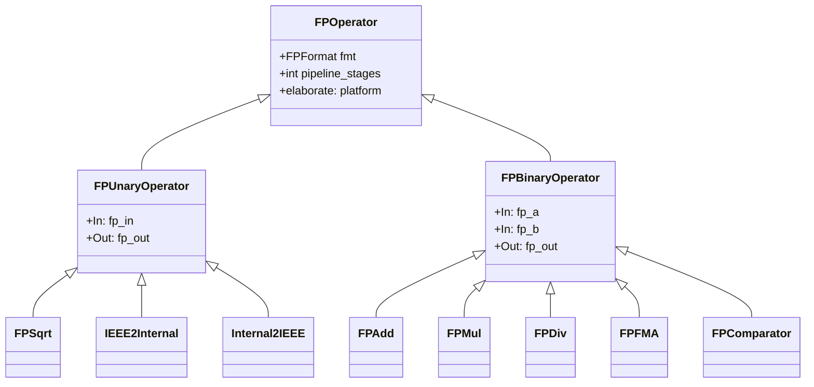
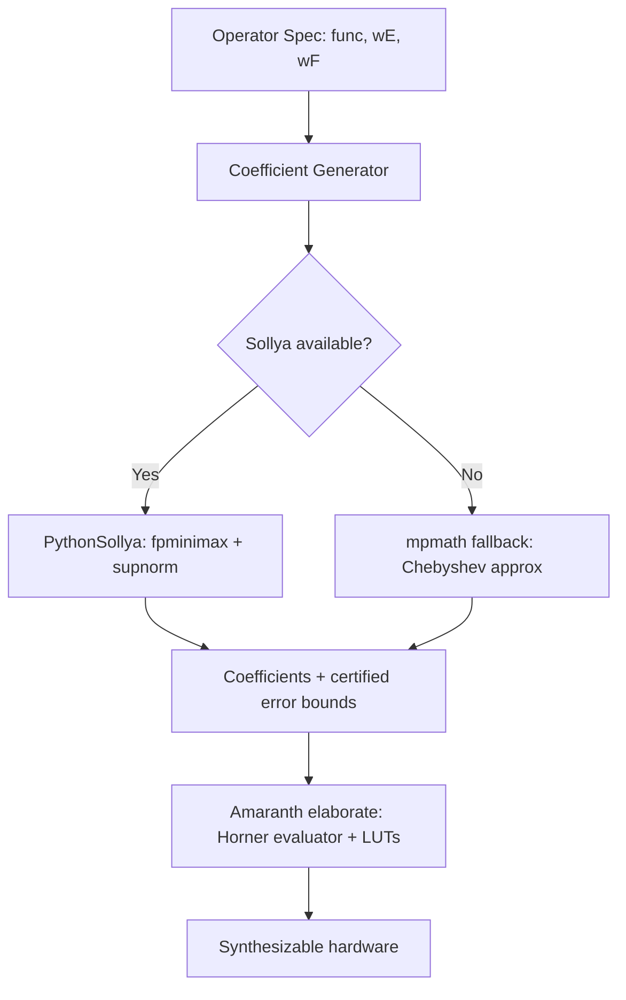

# Amaranth-FP Architecture

A floating-point operator generator library for Amaranth HDL, inspired by FloPoCo.

---

## 1. Project Overview

### Goals

- Provide parameterized, synthesizable floating-point operators as Amaranth `wiring.Component` modules
- Support arbitrary precision (configurable exponent and fraction widths)
- Generate correct, efficient hardware — faithfully or correctly rounded
- Offer a code-generation mode that emits standalone `.py` files for each configured operator
- Integrate with PythonSollya (or mpmath fallback) for function approximation (transcendentals, table-based methods)

### Scope

**In scope (Phase 1):** IEEE 754 arithmetic (add, sub, mul, div, sqrt, FMA), format conversions, comparators, building blocks (shifters, normalizers, LZC).

**In scope (Phase 2):** Transcendental functions (exp, log, sin/cos) via polynomial approximation, posit support.

**Out of scope:** Vendor-specific primitive mappings (Xilinx CARRY4, DSP48), LNS arithmetic, complex/FFT operators.

### Comparison with FloPoCo

| Aspect | FloPoCo | Amaranth-FP |
|--------|---------|-------------|
| Language | C++ generating VHDL | Python generating Amaranth IR |
| Output | VHDL files | Amaranth `Elaboratable` / standalone `.py` / Verilog |
| Simulation | External VHDL sim | Amaranth built-in simulator |
| Pipelining | Automatic via Target model (ASAP scheduling) | Configurable manual pipeline stages |
| Internal FP format | 2-bit exception + sign + exp + frac | Same approach, adapted to Amaranth `data.StructLayout` |
| Bit heap | Full compression tree infrastructure | Simplified; rely on synthesis tools |
| Target model | Per-FPGA delay models (LUT, DSP, adder delays) | Target-agnostic; pipeline depth is explicit parameter |

---

## 2. FloPoCo Files We Can Borrow

FloPoCo contains significant reusable data that we should port rather than re-derive.

### 2.1 FPGA Target Models

Located in [`flopoco/code/HWTargets/src/Targets/`](flopoco/code/HWTargets/src/Targets/). Each file defines timing parameters for a specific FPGA family.

| File | FPGA Family | Data Contents |
|------|-------------|---------------|
| [`Kintex7.cpp`](flopoco/code/HWTargets/src/Targets/Kintex7.cpp) | Xilinx Kintex-7 | 6-input LUTs, DSP48E1 (25×18), carry chain delays, BRAM timing |
| [`StratixV.cpp`](flopoco/code/HWTargets/src/Targets/StratixV.cpp) | Intel Stratix V | ALM delays, 27×27 DSP multipliers, M20K BRAM timing |
| [`Virtex6.cpp`](flopoco/code/HWTargets/src/Targets/Virtex6.cpp) | Xilinx Virtex-6 | 6-input LUTs, DSP48E1 (25×18), timing |
| [`VirtexUltrascalePlus.cpp`](flopoco/code/HWTargets/src/Targets/VirtexUltrascalePlus.cpp) | Xilinx UltraScale+ | Updated LUT/DSP delays, faster carry chains |
| [`Versal.cpp`](flopoco/code/HWTargets/src/Targets/Versal.cpp) | Xilinx Versal | Latest architecture timing |
| [`Zynq7000.cpp`](flopoco/code/HWTargets/src/Targets/Zynq7000.cpp) | Xilinx Zynq-7000 | Similar to Kintex-7 with different speed grades |
| [`DummyFPGA.cpp`](flopoco/code/HWTargets/src/Targets/DummyFPGA.cpp) | Generic target | Conservative default delays, useful for testing |
| [`ManualPipeline.cpp`](flopoco/code/HWTargets/src/Targets/ManualPipeline.cpp) | Manual control | Disables auto-pipelining — user places register stages |

**What to extract from each target file:**
- `lutDelay()` — bare LUT propagation delay (seconds)
- `logicDelay(n)` — n-input logic function delay
- `adderDelay(n)` — n-bit addition delay (carry chain)
- `DSPMultiplierDelay()` — DSP block multiplier delay
- `tableDelay(wIn, wOut)` — lookup table delay
- `eqComparatorDelay(n)`, `ltComparatorDelay(n)` — comparison delays
- `lutInputs_` — LUT input count (4, 5, or 6)
- `possibleDSPConfig_` — available DSP multiplier sizes (e.g., `{25, 18}` for Xilinx, `{27, 27}` for Intel)
- `maxFrequency_` — maximum clock frequency
- `registerDelay_` — flip-flop clock-to-Q delay

**Target porting format** — convert to Python dataclass config files:

```python
@dataclass(frozen=True)
class FPGATarget:
    name: str
    lut_inputs: int                  # 4, 5, or 6
    lut_delay_s: float               # bare LUT delay in seconds
    register_delay_s: float          # FF clk-to-Q delay
    carry_delay_per_bit_s: float     # carry chain delay per bit
    dsp_multiplier_delay_s: float    # DSP block delay
    dsp_widths: tuple[int, int]      # e.g. (25, 18)
    bram_delay_s: float              # Block RAM access time
    max_frequency_hz: float          # maximum clock frequency

# Example: Kintex-7 at -2 speed grade
KINTEX7 = FPGATarget(
    name="Kintex7",
    lut_inputs=6,
    lut_delay_s=0.124e-9,
    register_delay_s=0.075e-9,
    carry_delay_per_bit_s=0.015e-9,
    dsp_multiplier_delay_s=1.680e-9,
    dsp_widths=(25, 18),
    bram_delay_s=1.590e-9,
    max_frequency_hz=741e6,
)
```

### 2.2 Base Target Class

[`Target.cpp`](flopoco/code/HWTargets/src/Target.cpp) contains the base delay computation logic — how `adderDelay(n)` combines `carry_delay × n + lut_delay`, how `tableDelay(wIn, wOut)` decides between LUT implementation (small tables) and BRAM (large tables), etc. This logic should be ported to a Python `TargetModel` class.

### 2.3 Operator Algorithm Constants

Several operators contain precomputed constants and tables:

- **SRT division selection tables** — [`FPDiv.cpp`](flopoco/code/VHDLOperators/src/FPDivSqrt/FPDiv.cpp) contains `selFunctionTable()` that precomputes the digit selection function for radix-4 SRT division. For each `(w_truncated, d_truncated)` pair, it finds the digit `k ∈ {-α..α}` satisfying convergence bounds.
- **Constant multiplier solutions** — [`tscm_solutions.cpp`](flopoco/code/VHDLOperators/src/ConstMult/) contains precomputed shift-and-add chains for common constant multiplications.
- **Exponential architecture parameters** — [`ExpArchitecture.cpp`](flopoco/code/HighLevelArithmetic/src/ExpLog/ExpArchitecture.cpp) contains precomputed optimal architecture choices (table sizes, polynomial degrees, BRAM counts) for various `(wE, wF)` combinations.

### 2.4 Table Data and Polynomial Coefficients

- [`src/Tables/`](flopoco/code/VHDLOperators/src/Tables/) — table operator infrastructure including `DiffCompressedTable` (differential compression reduces memory by storing base + delta)
- [`BasicPolyApprox.cpp`](flopoco/code/HighLevelArithmetic/src/FixFunctions/BasicPolyApprox.cpp) — polynomial approximation workflow that calls Sollya
- [`UniformPiecewisePolyApprox.cpp`](flopoco/code/HighLevelArithmetic/src/FixFunctions/UniformPiecewisePolyApprox.cpp) — piecewise polynomial with uniform intervals
- [`Multipartite*.cpp`](flopoco/code/HighLevelArithmetic/src/FixFunctions/MultipartiteTable/) — multipartite table decomposition (multiple small tables summed to approximate a function)

---

## 3. FP Format Representation

### IEEE 754 Format

Since Amaranth `data.Struct` field widths must be known at class-definition time, we use a factory function that returns a `data.StructLayout`:

```python
from amaranth.lib import data
from amaranth import unsigned

def ieee_float_layout(wE: int, wF: int) -> data.StructLayout:
    """Create an IEEE 754 FP layout. LSB-first field order for Cat() compatibility."""
    return data.StructLayout({
        "frac": unsigned(wF),    # fraction bits (without implicit 1)
        "exp":  unsigned(wE),    # biased exponent
        "sign": unsigned(1),     # sign bit (MSB)
    })
```

### Internal FP Format (FloPoCo-style)

FloPoCo uses a 2-bit exception field: `00`=zero, `01`=normal, `10`=inf, `11`=NaN. This simplifies special-case handling by eliminating the need to detect special exponent patterns (all-zeros for subnormals, all-ones for inf/NaN).

```python
def internal_float_layout(wE: int, wF: int) -> data.StructLayout:
    """FloPoCo-style internal FP format with explicit exception field."""
    return data.StructLayout({
        "frac": unsigned(wF),    # fractional part (implicit leading 1 for normals)
        "exp":  unsigned(wE),    # biased exponent (bias = 2^(wE-1) - 1)
        "sign": unsigned(1),     # sign bit
        "exc":  unsigned(2),     # 00=zero, 01=normal, 10=inf, 11=NaN
    })
```

Key advantage: FloPoCo has **one more exponent value** than IEEE — the all-zeros exponent field encodes `emin - 1`, allowing some IEEE subnormals to be represented as normal numbers. This avoids the denormal handling complexity in the main datapath.

### FPFormat Descriptor

A Python-only descriptor to parameterize operators:

```python
from dataclasses import dataclass

@dataclass(frozen=True)
class FPFormat:
    wE: int   # exponent bits
    wF: int   # fraction bits

    @property
    def bias(self) -> int:
        return (1 << (self.wE - 1)) - 1

    @property
    def total_bits(self) -> int:
        """IEEE total width = 1 + wE + wF."""
        return 1 + self.wE + self.wF

    @property
    def internal_bits(self) -> int:
        """FloPoCo internal width = 2 + 1 + wE + wF."""
        return 3 + self.wE + self.wF

    @property
    def emin(self) -> int:
        return 1 - self.bias

    @property
    def emax(self) -> int:
        return self.bias

    def ieee_layout(self) -> data.StructLayout:
        return ieee_float_layout(self.wE, self.wF)

    def internal_layout(self) -> data.StructLayout:
        return internal_float_layout(self.wE, self.wF)

# Predefined formats
FPFormat.HALF    = FPFormat(5, 10)
FPFormat.SINGLE  = FPFormat(8, 23)
FPFormat.DOUBLE  = FPFormat(11, 52)
FPFormat.QUAD    = FPFormat(15, 112)
```

### Using Layouts with Amaranth Signals

```python
from amaranth import *
from amaranth.lib.data import View

fmt = FPFormat.SINGLE
layout = fmt.internal_layout()

# Create a signal with structured layout
fp_val = Signal(layout)

# Access fields
m.d.comb += [
    fp_val.sign.eq(0),
    fp_val.exc.eq(0b01),     # normal
    fp_val.exp.eq(127),       # biased exponent for 2^0
    fp_val.frac.eq(0),        # 1.0
]

# View an existing signal as FP
raw = Signal(layout.size)
fp_view = View(layout, raw)
```

---

## 4. Amaranth Integration Patterns

### 4.1 Component Subclass with Signature

Every FP operator is a `wiring.Component` with typed ports:

```python
from amaranth import *
from amaranth.lib.wiring import Component, In, Out

class FPAdd(Component):
    """Floating-point adder. Parameterized by format and pipeline depth."""

    def __init__(self, fmt: FPFormat, pipeline_stages: int = 0):
        self._fmt = fmt
        self._pipeline_stages = pipeline_stages
        layout = fmt.internal_layout()
        super().__init__({
            "a":   In(layout),
            "b":   In(layout),
            "out": Out(layout),
        })

    def elaborate(self, platform):
        m = Module()
        wE = self._fmt.wE
        wF = self._fmt.wF

        # Unpack inputs
        sign_a = self.a.sign
        exp_a  = self.a.exp
        frac_a = self.a.frac
        exc_a  = self.a.exc
        # ... (algorithm implementation below)

        return m
```

### 4.2 Pipeline Register Insertion Pattern

Amaranth has no built-in auto-pipelining. We use a **signal-bundle register stage** approach:

```python
class PipelineStage(Component):
    """Insert a register boundary between combinational stages."""
    def __init__(self, layout):
        super().__init__({
            "inp": In(layout),
            "out": Out(layout),
            "en":  In(1),
        })

    def elaborate(self, platform):
        m = Module()
        with m.If(self.en):
            m.d.sync += self.out.as_value().eq(self.inp.as_value())
        return m
```

Within an operator, pipeline stages are inserted at chosen cut points:

```python
def elaborate(self, platform):
    m = Module()

    # Stage 0: Compare & swap, exponent difference
    exp_diff = Signal(self._fmt.wE + 1)
    m.d.comb += exp_diff.eq(exp_a - exp_b)
    # ... more stage 0 logic ...

    # Define inter-stage bundle
    stage0_layout = data.StructLayout({
        "exp_diff":   unsigned(self._fmt.wE + 1),
        "frac_large": unsigned(self._fmt.wF + 1),
        "frac_small": unsigned(self._fmt.wF + 1),
        "eff_sub":    unsigned(1),
        "sign_r":     unsigned(1),
        "exp_large":  unsigned(self._fmt.wE),
        "exc_r":      unsigned(2),
    })

    if self._pipeline_stages >= 1:
        # Insert register
        stage0_out = Signal(stage0_layout)
        m.d.sync += [
            stage0_out.exp_diff.eq(exp_diff),
            stage0_out.frac_large.eq(frac_large),
            # ... etc
        ]
    else:
        # Combinational pass-through
        stage0_out = Signal(stage0_layout)
        m.d.comb += [
            stage0_out.exp_diff.eq(exp_diff),
            # ... etc
        ]

    # Stage 1: Alignment, addition ...
    # Use stage0_out.exp_diff, stage0_out.frac_large, etc.
    ...
```

### 4.3 Stream-Based Pipelining (for iterative operators)

For operators like FPDiv that iterate over multiple cycles, use `stream.Signature` with valid/ready handshaking:

```python
from amaranth.lib import stream

class FPDiv(Component):
    """SRT radix-4 divider with valid/ready handshaking."""

    def __init__(self, fmt: FPFormat):
        self._fmt = fmt
        layout = fmt.internal_layout()
        pair_layout = data.StructLayout({
            "a": layout,
            "b": layout,
        })
        super().__init__({
            "sink":   In(stream.Signature(pair_layout)),
            "source": Out(stream.Signature(layout)),
        })

    def elaborate(self, platform):
        m = Module()
        wF = self._fmt.wF
        n_iterations = (wF + 3) // 2  # radix-4: ~wF/2 iterations

        with m.FSM():
            with m.State("IDLE"):
                m.d.comb += self.sink.ready.eq(1)
                with m.If(self.sink.valid):
                    # Capture inputs, start iteration
                    m.next = "ITERATE"

            with m.State("ITERATE"):
                # SRT iteration logic
                with m.If(iteration_counter == 0):
                    m.next = "OUTPUT"

            with m.State("OUTPUT"):
                m.d.comb += [
                    self.source.valid.eq(1),
                    self.source.payload.eq(result),
                ]
                with m.If(self.source.ready):
                    m.next = "IDLE"

        return m
```

### 4.4 Composing Operators with `wiring.connect()`

```python
from amaranth.lib.wiring import connect, flipped

class FPMulAdd(Component):
    """Compute A*B + C using separate mul and add."""
    def __init__(self, fmt: FPFormat):
        layout = fmt.internal_layout()
        super().__init__({
            "a":   In(layout),
            "b":   In(layout),
            "c":   In(layout),
            "out": Out(layout),
        })
        self._fmt = fmt

    def elaborate(self, platform):
        m = Module()
        m.submodules.mul = mul = FPMul(self._fmt)
        m.submodules.add = add = FPAdd(self._fmt)

        # Drive mul inputs
        m.d.comb += [
            mul.a.eq(self.a),
            mul.b.eq(self.b),
        ]
        # Connect mul output to add input
        m.d.comb += [
            add.a.eq(mul.out),
            add.b.eq(self.c),
        ]
        # Forward add output
        m.d.comb += self.out.eq(add.out)

        return m
```

For stream-based operators, use `wiring.connect()`:

```python
class StreamPipeline(Component):
    sink:   In(stream.Signature(pair_layout))
    source: Out(stream.Signature(result_layout))

    def elaborate(self, platform):
        m = Module()
        m.submodules.stage1 = stage1 = StreamOp1()
        m.submodules.stage2 = stage2 = StreamOp2()

        connect(m, flipped(self.sink), stage1.sink)
        connect(m, stage1.source, stage2.sink)
        connect(m, stage2.source, flipped(self.source))

        return m
```

### 4.5 Verilog Generation via Backend

```python
from amaranth.back.verilog import convert

adder = FPAdd(FPFormat.SINGLE, pipeline_stages=3)
verilog_text = convert(adder)

with open("fp_add_single.v", "w") as f:
    f.write(verilog_text)
```

Amaranth's backend flow:
1. `elaborate()` is called → produces `Module` (an Amaranth IR tree)
2. `Fragment.prepare()` flattens the hierarchy into RTLIL (Yosys intermediate representation)
3. `back.verilog` or `back.rtlil` serializes RTLIL to the target format
4. The output is **target-agnostic** — synthesis tools (Vivado, Quartus, Yosys) handle technology mapping

### 4.6 LUT-Based Tables with `Memory`

For precomputed lookup tables (e.g., SRT selection tables, function approximation):

```python
from amaranth.lib.memory import Memory

class SelectionTable(Component):
    """SRT digit selection function table."""
    def __init__(self, table_data: list[int], addr_width: int, data_width: int):
        self._data = table_data
        self._addr_width = addr_width
        self._data_width = data_width
        super().__init__({
            "addr": In(addr_width),
            "data": Out(data_width),
        })

    def elaborate(self, platform):
        m = Module()

        mem = Memory(
            shape=unsigned(self._data_width),
            depth=2**self._addr_width,
            init=self._data,
        )
        m.submodules.mem = mem
        rd = mem.read_port(domain="comb")  # combinational read
        m.d.comb += [
            rd.addr.eq(self.addr),
            self.data.eq(rd.data),
        ]

        return m
```

---

## 5. Module Hierarchy



All operators inherit from `wiring.Component` and expose either direct-signal or stream-compatible interfaces depending on configuration.

---

## 6. Core Operators — Detailed Algorithm Specifications

### 6.1 IEEE ↔ Internal Format Converters

#### InputIEEE (IEEE → Internal)

Based on FloPoCo's [`InputIEEE.cpp`](flopoco/code/VHDLOperators/src/Conversions/InputIEEE.cpp):

```
INPUT:  X in IEEE 754 format (wE, wF)
OUTPUT: R in FloPoCo internal format (wE, wF)

1. UNPACK
   expX  = X[wE+wF-1 : wF]       // biased exponent
   fracX = X[wF-1 : 0]            // fraction (without implicit 1)
   sX    = X[wE+wF]               // sign

2. DETECT SPECIAL CASES
   expZero  = (expX == 0)
   expMax   = (expX == all-ones)
   fracZero = (fracX == 0)

3. BUILD EXCEPTION FIELD
   if expZero and fracZero:
       exc = 00  (zero)
   elif expZero and not fracZero:
       // Subnormal — check if representable in FloPoCo format
       if fracX[wF-1] == 1:    // MSB of fraction is 1
           // Representable as FloPoCo normal with exponent = emin
           exc = 01; exp = 0; frac = fracX << 1  // shift out implicit bit
       else:
           exc = 00  (flush to zero)  // not representable
   elif expMax and fracZero:
       exc = 10  (infinity)
   elif expMax and not fracZero:
       exc = 11  (NaN)
   else:
       exc = 01  (normal)

4. ASSEMBLE
   R = exc & sX & expX & fracX  (or modified frac for subnormals)
```

For **precision conversion** (wEI ≠ wEO or wFI ≠ wFO):
- **Narrowing exponent** (wEI > wEO): detect overflow (exp > emax_out → infinity) and underflow (exp < emin_out → zero/subnormal)
- **Widening exponent** (wEI < wEO): zero-extend with bias correction: `expO = expI + (biasO - biasI)`
- **Narrowing fraction** (wFI > wFO): round-to-nearest-even on discarded bits
- **Widening fraction** (wFI < wFO): zero-pad LSBs

#### OutputIEEE (Internal → IEEE)

Reverses InputIEEE: maps `exc` field back to IEEE special exponent encoding, inserts implicit 1 for subnormals, handles rounding.

### 6.2 FPAdd — Single-Path Algorithm

Based on FloPoCo's [`FPAddSinglePath.cpp`](flopoco/code/VHDLOperators/src/FPAddSub/FPAddSinglePath.cpp). Total width tracking shown for `(wE=8, wF=23)`:

```
INPUTS: X, Y in FloPoCo internal format

1. COMPARE & SWAP                          // Pipeline cut point 0
   // Compare |X| vs |Y| using exc & exp & frac concatenation
   cmpResult = Cat(excX, expX, fracX) >= Cat(excY, expY, fracY)
   swap = ~cmpResult
   // After swap: newX = larger magnitude, newY = smaller
   // Width: signX(1), expX(wE), fracX(wF), excX(2) — same for Y

2. EXPONENT DIFFERENCE
   expDiff = expNewX - expNewY             // width: wE+1 bits (signed)
   // Clamp to wF+3 (max useful shift distance)

3. ALIGNMENT (right-shift smaller significand)
   fracNewY_ext = Cat(0, 1, fracNewY, 0, 0)  // "0" & "1.fracY" & "00" (guard+round)
   // Width: 1 + 1 + wF + 2 = wF+4 bits
   shiftedFracY = Shifter(fracNewY_ext, expDiff, direction=RIGHT, computeSticky=True)
   // Sticky bit = OR of all bits shifted out
   // Output width: wF+4 bits + 1 sticky bit

4. EFFECTIVE OPERATION
   effSub = signNewX XOR signNewY
   fracNewX_ext = Cat(0, 1, fracNewX, 0, 0)  // "01.fracX00"
   // Width: wF+4 bits

5. CONDITIONAL NEGATE (for subtraction)
   if effSub:
       fracYpadXored = ~shiftedFracY
       cInAdd = effSub AND (NOT sticky)    // borrow correction
   else:
       fracYpadXored = shiftedFracY
       cInAdd = 0

6. SIGNIFICAND ADDITION                    // Pipeline cut point 1
   fracResult = fracNewX_ext + fracYpadXored + cInAdd
   // Width: wF+5 bits (one extra for carry)

7. NORMALIZATION
   // LZC on fracResult (only needed for subtraction path)
   lzCount = LZC(fracResult)              // width: ceil(log2(wF+5)) bits
   // Left-shift to normalize
   normalizedFrac = fracResult << lzCount  // width: wF+5 bits

   // For addition (carry-out): right-shift by 1 instead
   if fracResult[MSB]:  // carry out of addition
       normalizedFrac = fracResult >> 1
       expAdjust = +1
   else:
       expAdjust = -lzCount

8. EXPONENT UPDATE                         // Pipeline cut point 2
   expResult = expNewX + 1 - lzCount      // width: wE+2 bits (signed, for overflow detect)
   // Alternatively: expExtended = expNewX + expAdjust

9. ROUNDING (round-to-nearest-even)
   // Extract rounding bits from normalizedFrac:
   //   [MSB ... fracBit(wF) | round | sticky_0 | sticky_1 ...]
   fracOut  = normalizedFrac[4 : 4+wF]    // wF bits
   roundBit = normalizedFrac[3]
   stickyBit = normalizedFrac[2] | normalizedFrac[1] | normalizedFrac[0] | sticky

   lsb = fracOut[0]
   needToRound = (roundBit & stickyBit) | (roundBit & ~stickyBit & lsb)
   roundedExpFrac = Cat(fracOut, expResult) + needToRound
   // Width: wE + wF bits; carry from fraction into exponent is correct behavior
   // Post-round overflow: if exponent overflows → infinity

10. EXCEPTION HANDLING
    // Truth table on (excX, excY, effSub):
    //   zero + zero  → zero
    //   zero + normal → normal
    //   inf + inf (same sign) → inf
    //   inf + inf (diff sign) → NaN
    //   NaN + anything → NaN
    //   anything + NaN → NaN
    // Post-normalization: if expResult overflows → infinity
    // Exact zero in subtraction → +0 (in RNE mode)

OUTPUT: R = excR(2) & signR(1) & expR(wE) & fracR(wF)
```

**Pipeline cut points** for single-precision (typical):
- Cut 0: After compare/swap + exponent difference
- Cut 1: After significand addition
- Cut 2: After normalization + rounding

FloPoCo also implements a **dual-path** variant that separates the "close path" (exponent difference ≤ 1, massive cancellation possible) from the "far path" (exponent difference > 1, no cancellation). This improves critical path for large precisions but is more complex.

### 6.3 FPMul — Significand Multiplication

Based on FloPoCo's [`FPMult.cpp`](flopoco/code/VHDLOperators/src/FPMultSquare/FPMult.cpp):

```
INPUTS: X, Y in FloPoCo internal format (wE, wF)

1. SIGN
   signR = signX XOR signY                // 1 bit

2. EXPONENT ADDITION                       // Pipeline cut point 0
   expSum = ("00" & expX) + ("00" & expY)  // wE+2 bits (unsigned, to detect overflow)
   expBiased = expSum - bias               // subtract bias once (was added twice)
   // Width: wE+2 bits (can go negative for underflow)

3. SIGNIFICAND MULTIPLICATION
   sigX = Cat(fracX, 1)                   // 1.fracX — width: wF+1 bits
   sigY = Cat(fracY, 1)                   // 1.fracY — width: wF+1 bits
   sigProd = sigX * sigY                  // width: 2*(wF+1) bits
   // For faithful rounding: only need top wF+3 bits of product
   // For correct rounding: need full product

4. NORMALIZATION                           // Pipeline cut point 1
   // Product is in range [1.0, 4.0) — top bit indicates:
   //   sigProd[2*wF+1] == 1 → product ∈ [2.0, 4.0), need right-shift by 1
   //   sigProd[2*wF+1] == 0 → product ∈ [1.0, 2.0), already normalized
   norm = sigProd[2*(self._fmt.wF+1) - 1]
   expPostNorm = expBiased + norm          // adjust exponent

   // Select significand bits based on norm
   if norm:
       fracR_raw = sigProd[wF+1 : 2*wF+2]  // shift right by 1
       guardBit  = sigProd[wF]
       stickyBits = sigProd[0 : wF].any()
   else:
       fracR_raw = sigProd[wF : 2*wF+1]    // no shift
       guardBit  = sigProd[wF-1]
       stickyBits = sigProd[0 : wF-1].any()

5. ROUNDING (round-to-nearest-even)        // Pipeline cut point 2
   lsb = fracR_raw[0]
   needToRound = (guardBit & stickyBits) | (guardBit & ~stickyBits & lsb)
   roundedExpFrac = Cat(fracR_raw, expPostNorm) + needToRound

6. EXCEPTION HANDLING
   // excSel = Cat(excX, excY) — 4-bit concatenation
   //   00 × anything = zero (0 × x = 0)
   //   anything × 00 = zero
   //   01 × 01 = normal × normal → normal (may overflow to inf)
   //   01 × 10 = normal × inf → inf
   //   10 × 01 = inf × normal → inf
   //   10 × 10 = inf × inf → inf
   //   00 × 10 = zero × inf → NaN  (indeterminate)
   //   10 × 00 = inf × zero → NaN
   //   anything × 11 = NaN, 11 × anything = NaN
   // Post-norm: check expPostNorm for overflow (→ inf) or underflow (→ zero)

OUTPUT: R = excR(2) & signR(1) & expR(wE) & fracR(wF)
```

### 6.4 FPDiv — SRT Digit-Recurrence Division

Based on FloPoCo's [`FPDiv.cpp`](flopoco/code/VHDLOperators/src/FPDivSqrt/FPDiv.cpp). Uses **radix-4 SRT** with digit set `{-2, -1, 0, 1, 2}` (α=2):

```
INPUTS: X (dividend), Y (divisor) in FloPoCo internal format (wE, wF)

1. PREPROCESSING
   fX = Cat(fracX, 1)                    // 1.fracX — width: wF+1 bits
   fY = Cat(fracY, 1)                    // 1.fracY — width: wF+1 bits
   expR0 = expX - expY                   // width: wE+1 bits (signed)
   signR = signX XOR signY

2. NUMBER OF ITERATIONS
   nDigit = ceil((wF + 3) / 2) + 1      // radix-4 produces 2 bits per iteration

3. PARTIAL REMAINDER INITIALIZATION
   // w[nDigit-1] = fX, zero-extended to computation width
   // Computation width: typically wF + 6 (for convergence margin)
   w = Signal(signed(wF + 8))
   m.d.comb += w.eq(Cat(0, 0, 0, fX, 0))  // proper alignment

4. SRT ITERATION LOOP (unrolled in hardware)
   FOR i = nDigit-1 DOWNTO 0:            // Each iteration is combinational or pipelined
     // Selection function: truncate w and D to select digit
     // Typically uses top 5-6 bits of w and top 3-4 bits of D
     sel_input = Cat(w[top:top-6], fY[wF:wF-3])
     q_digit = SelectionTable[sel_input]  // digit ∈ {-2, -1, 0, 1, 2}

     // Compute q[i] × D (using shifts and adds)
     // q=0: 0; q=±1: ±D; q=±2: ±(D<<1)
     qD = Mux(q==2, D<<1, Mux(q==1, D, Mux(q==-1, -D, Mux(q==-2, -(D<<1), 0))))

     // Update partial remainder: w_next = 4 * (w - qD)
     w_next = (w - qD) << 2              // radix-4: shift left by 2

     // On-the-fly quotient conversion (avoids final subtraction)
     if q_digit >= 0:
         qP[i] = q_digit
         qM[i] = 0
     else:
         qP[i] = 0
         qM[i] = -q_digit

     // Pipeline cut: typically every 1-3 iterations

5. QUOTIENT ASSEMBLY
   quotient = qP_concatenated - qM_concatenated
   // Width: 2*nDigit bits ≈ wF+4 bits

6. NORMALIZATION
   // quotient ∈ [0.5, 2.0) — may need 1-bit left shift
   norm = ~quotient[MSB]
   if norm:
       quotient = quotient << 1
       expR0 = expR0 - 1

7. ROUNDING & EXCEPTION HANDLING
   expR = expR0 + bias
   fracR = quotient[top wF bits]
   // Round as in FPAdd/FPMul
   // Exceptions: 0/0 → NaN, x/0 → ±inf, 0/x → 0, inf/inf → NaN

OUTPUT: R = excR(2) & signR(1) & expR(wE) & fracR(wF)
```

**Selection table generation** (from FloPoCo `selFunctionTable()`):
For each truncated `(w_hat, d_hat)` pair, find the digit `k` satisfying convergence: `L_k(d) ≤ w < U_k(d)` where `L_k(d) = k - d/2` and `U_k(d) = k + d/2` (simplified for radix-4, α=2). The table is precomputed at elaboration time and stored in an Amaranth `Memory`.

### 6.5 FPSqrt — Digit-Recurrence Square Root

Based on FloPoCo's [`FPSqrt.cpp`](flopoco/code/VHDLOperators/src/FPDivSqrt/FPSqrt.cpp). Binary restoring algorithm from Parhami:

```
INPUT: X in FloPoCo internal format (wE, wF)

1. PREPROCESSING
   // Halve the exponent
   expR = (expX >> 1) + (bias >> 1) + expX[0]
   // Adjust fraction based on exponent parity:
   //   Even exponent: R[0] = "0" & "1" & fracX & "0"  (fX in [1,2))
   //   Odd exponent:  R[0] = "1" & fracX & "00"       (fX in [2,4))

2. ITERATION (i = 1 to wF+1)
   // Binary restoring: one bit of result per iteration
   TwoR = R[i-1] << 1                       // shift left
   T[i] = TwoR - Cat(1, S[i-1], 0, 1)     // tentative subtraction
   d[i] = ~T[i][MSB]                        // d=1 if T≥0 (non-restoring)
   S[i] = Cat(d[i], S[i-1])                // append digit to result
   R[i] = Mux(d[i], T[i], TwoR)           // restore if T<0

3. RESULT
   fracR = S[wF+1][wF:1]                    // remove leading 1
   roundBit = d[wF+1]                        // last digit is round bit
   // Exact zero remainder → round to even
   signR = 0  (sqrt is always non-negative)

4. EXCEPTION HANDLING
   // sqrt(0) = 0, sqrt(inf) = inf, sqrt(NaN) = NaN
   // sqrt(negative) = NaN (if signX=1 and excX=01)

OUTPUT: R = excR(2) & 0 & expR(wE) & fracR(wF)
```

### 6.6 FPFMA — Fused Multiply-Add

Computes `A*B + C` with a single rounding at the end:

```
INPUTS: A, B, C in FloPoCo internal format

1. MULTIPLY A*B (full precision, NO intermediate rounding)
   sigA = "1" & fracA                      // wF+1 bits
   sigB = "1" & fracB                      // wF+1 bits
   product = sigA * sigB                    // 2*(wF+1) bits
   expProduct = expA + expB - bias
   signProduct = signA XOR signB

2. ALIGN ADDEND C
   expDiff = expProduct - expC
   // Addend needs alignment over the full product width + guard bits
   // Alignment range: -(2*wF+2) to +(2*wF+2)
   sigC_aligned = Shifter("1" & fracC, expDiff, RIGHT, computeSticky=True)

3. THREE-INPUT ADDITION
   // Effective operation: product ± aligned_C
   effSub = signProduct XOR signC
   if effSub:
       sum = product - sigC_aligned  (or vice versa based on magnitude)
   else:
       sum = product + sigC_aligned

4. NORMALIZATION (LZC + left-shift)
   // May need up to 2*wF+2 bit left-shift for massive cancellation

5. SINGLE ROUNDING to (wE, wF)
   // Only one rounding step — this is what makes FMA "fused"

6. EXCEPTION HANDLING
   // inf*0+C → NaN, etc.
```

---

## 7. Building Blocks

| Block | Parameters | Description | Amaranth Implementation |
|-------|-----------|-------------|------------------------|
| `Shifter` | width, max_shift, direction, sticky | Barrel shifter (left/right) with optional sticky bit | Log-depth mux tree, one stage per shift-amount bit |
| `LZC` | width | Leading zero counter, tree structure | Recursive priority encoder; output width: `ceil(log2(width))+1` |
| `Normalizer` | wX, wR, max_shift, sticky | LZC + left-shift combined | LZC submodule → feeds shift amount to left Shifter |
| `IntAdder` | width | Integer adder (wraps Amaranth `+` with carry) | `m.d.comb += o.eq(a + b + cin)` |
| `IntMultiplier` | wX, wY | Integer multiplier for significand products | `m.d.comb += o.eq(a * b)` (synthesis maps to DSP) |
| `RoundingUnit` | wF, mode | Applies RNE / other IEEE rounding modes | Combinational logic on guard/round/sticky |
| `ExceptionLogic` | — | Computes exception flags from exc fields | Combinational truth table (Switch/Case) |

Each building block is a standalone `wiring.Component` reusable across operators.

---

## 8. Pipelining Architecture

### 8.1 FloPoCo's ASAP Scheduling Model

FloPoCo uses **on-the-fly ASAP scheduling** with signal delay annotations:

1. Each `declare(delay, name, width)` annotates a signal with its critical-path contribution in seconds
2. Dependencies are extracted from VHDL statements
3. When accumulated delay in a cycle exceeds `1/target_frequency`, a new pipeline stage is created
4. Pipeline registers are automatically inserted for signals that cross stage boundaries

This is fundamentally incompatible with Amaranth, which generates target-agnostic RTLIL and has no timing model. We adopt a different approach.

### 8.2 Amaranth-FP Pipeline Strategy

**Manual pipeline stages with parameterized depth:**

```python
class PipelinedOperator(Component):
    def __init__(self, fmt, pipeline_stages=0):
        self._stages = pipeline_stages
        # ...

    def elaborate(self, platform):
        m = Module()

        # Define N combinational stage functions
        # Each stage takes input signals and produces output signals
        stage_outputs = []

        # Stage 0: Compare, swap, exponent diff
        s0 = self._build_stage0(m)
        stage_outputs.append(s0)

        # Stage 1: Alignment, addition
        s1 = self._build_stage1(m, s0)
        stage_outputs.append(s1)

        # Stage 2: Normalization, rounding
        s2 = self._build_stage2(m, s1)
        stage_outputs.append(s2)

        # Insert registers at chosen boundaries
        # With pipeline_stages=0: fully combinational
        # With pipeline_stages=1: register after stage 0
        # With pipeline_stages=2: register after stage 0 and stage 1
        # With pipeline_stages=3: register after each stage
        ...
```

**Strategy for choosing pipeline cut points:**
1. Profile with synthesis tools to find the critical path
2. Cut at algorithmically natural boundaries (after alignment, after addition, after normalization)
3. The `pipeline_stages` parameter selects from a predefined set of cut configurations
4. `pipeline_stages=0` is always supported (fully combinational)

### 8.3 Latency Tracking

Each operator exposes its latency:

```python
class FPAdd(Component):
    @property
    def latency(self) -> int:
        """Number of clock cycles from input to output."""
        return self._pipeline_stages
```

For stream-based operators (FPDiv), latency is variable (depends on iteration count):

```python
class FPDiv(Component):
    @property
    def min_latency(self) -> int:
        return self._n_iterations + 2  # setup + iterations + output
```

### 8.4 Pipeline Helper Utility

A utility to simplify register insertion:

```python
def pipeline_register(m, signals: dict, enable=None, domain="sync"):
    """Insert a register stage for a bundle of signals.

    Args:
        m: Module to add registers to
        signals: dict mapping name → (input_signal, output_signal)
        enable: optional enable signal
        domain: clock domain
    """
    for name, (inp, out) in signals.items():
        if enable is not None:
            with m.If(enable):
                m.d[domain] += out.eq(inp)
        else:
            m.d[domain] += out.eq(inp)
```

---

## 9. Sollya / mpmath Integration for Coefficient Generation

### 9.1 Overview

Transcendental functions (exp, log, sin, cos) and table-based function approximations require precomputed polynomial coefficients and LUT contents. These are computed at **Python elaboration time** — before any hardware is generated.



### 9.2 Polynomial Coefficient Generation with Sollya

For a hardware polynomial evaluator approximating function `f` on interval `[a, b]` with `n`-bit accuracy:

```python
def generate_poly_coefficients(f_str, degree, interval, coeff_bits, use_sollya=True):
    """Generate fixed-point polynomial coefficients for hardware.

    Args:
        f_str: function string, e.g. "sin(x)"
        degree: polynomial degree
        interval: (lo, hi) tuple
        coeff_bits: bit width for each coefficient
        use_sollya: try Sollya first, fall back to mpmath

    Returns:
        list of integer coefficients (fixed-point, scaled by 2^coeff_bits)
        float: certified maximum error (or estimated if fallback)
    """
    if use_sollya:
        try:
            return _generate_with_sollya(f_str, degree, interval, coeff_bits)
        except ImportError:
            pass
    return _generate_with_mpmath(f_str, degree, interval, coeff_bits)

def _generate_with_sollya(f_str, degree, interval, coeff_bits):
    from sollya import *
    settings.prec = max(200, coeff_bits * 2)

    f = parse(f_str)  # e.g. sin(x)
    dom = Interval(interval[0], interval[1])

    # Compute FP-constrained minimax polynomial
    formats = [SollyaObject(coeff_bits)] * (degree + 1)
    poly = fpminimax(f, degree, formats, dom, absolute, fixed)

    # Verify error
    target_err = SollyaObject(2) ** (-(coeff_bits - 2))
    err = supnorm(poly, f, dom, absolute, SollyaObject(2) ** (-300))

    # Extract integer coefficients
    coeffs = []
    for i in range(degree + 1):
        c = coeff(poly, i)
        c_int = int(c * SollyaObject(2) ** coeff_bits)
        coeffs.append(c_int)

    return coeffs, float(sup(err))

def _generate_with_mpmath(f_str, degree, interval, coeff_bits):
    import mpmath
    mpmath.mp.prec = max(200, coeff_bits * 2)

    f = eval(f"mpmath.{f_str.replace('x', '(x)')}", {"mpmath": mpmath, "x": None})
    # Use Chebyshev approximation (near-minimax but not optimal)
    lo, hi = interval
    coeffs_float = mpmath.chebyfit(
        lambda x: eval(f_str, {"x": x, **{k: getattr(mpmath, k) for k in dir(mpmath)}}),
        [lo, hi], degree
    )

    # Convert to fixed-point integers
    scale = 2 ** coeff_bits
    coeffs_int = [int(c * scale) for c in coeffs_float]

    # Estimate error (non-certified)
    max_err = 0.0
    for i in range(1000):
        x = lo + (hi - lo) * i / 999
        exact = float(eval(f_str, {"x": x, **{k: getattr(mpmath, k) for k in dir(mpmath)}}))
        approx = sum(c * x**j for j, c in enumerate(coeffs_float))
        max_err = max(max_err, abs(exact - approx))

    return coeffs_int, max_err
```

### 9.3 LUT Content Generation

For table-based function approximation (e.g., initial approximation for reciprocal, trig functions):

```python
def generate_lut_contents(f, input_bits, output_bits, domain=(0.0, 1.0)):
    """Generate lookup table contents for a function.

    Args:
        f: callable (Python function)
        input_bits: address width
        output_bits: data width
        domain: (lo, hi) input range

    Returns:
        list of integers, length 2^input_bits
    """
    import mpmath
    mpmath.mp.prec = output_bits + 32  # extra precision for rounding

    num_entries = 2 ** input_bits
    lo, hi = domain
    table = []

    for i in range(num_entries):
        # Center of the i-th interval
        x = lo + (i + 0.5) * (hi - lo) / num_entries
        y = f(mpmath.mpf(x))
        # Convert to fixed-point integer
        y_scaled = int(mpmath.nint(y * mpmath.mpf(2) ** output_bits))
        # Clamp to output range
        y_clamped = max(0, min((1 << output_bits) - 1, y_scaled))
        table.append(y_clamped)

    return table
```

### 9.4 Using Generated Data in Amaranth

```python
class FixSin(Component):
    """Fixed-point sine approximation using table + polynomial."""

    def __init__(self, input_bits=16, output_bits=16):
        super().__init__({
            "x":   In(unsigned(input_bits)),
            "sin": Out(signed(output_bits)),
        })

        # Generate at elaboration time
        self._table_data = generate_lut_contents(
            f=lambda x: float(mpmath.sin(x)),
            input_bits=8,    # top 8 bits for table
            output_bits=output_bits,
            domain=(0, math.pi / 4),
        )
        self._poly_coeffs = generate_poly_coefficients(
            f_str="sin(x)", degree=3,
            interval=(0, math.pi / 256),
            coeff_bits=output_bits,
        )

    def elaborate(self, platform):
        m = Module()

        # Table lookup for coarse approximation
        mem = Memory(shape=signed(16), depth=256, init=self._table_data)
        m.submodules.lut = mem
        rd = mem.read_port(domain="comb")
        m.d.comb += rd.addr.eq(self.x[8:16])  # top 8 bits

        # Polynomial refinement on lower bits (Horner scheme)
        # sin(x0 + dx) ≈ table[x0] + dx * (c1 + dx * (c2 + dx * c3))
        dx = self.x[0:8]  # lower 8 bits
        # ... Horner evaluation hardware ...

        return m
```

### 9.5 Fallback Strategy

```python
try:
    import sollya
    from sollya import *
    HAS_SOLLYA = True
except ImportError:
    HAS_SOLLYA = False
    import mpmath  # always available as pure Python fallback
```

**Sollya** provides: optimal minimax coefficients via `fpminimax`, certified error bounds via `supnorm`, FP-constrained coefficient formats.

**mpmath** provides: Chebyshev approximation (near-minimax), arbitrary precision, no certified bounds but adequate for most practical uses.

---

## 10. Code Generation Mode

The library supports two usage modes:

### Mode 1: Direct Instantiation (Normal)
```python
from amaranth_fp import FPAdd, FPFormat

adder = FPAdd(fmt=FPFormat.SINGLE, pipeline_stages=2)
# Use as submodule in your Amaranth design
```

### Mode 2: Standalone File Generation

```python
from amaranth_fp.codegen import generate_module

generate_module(
    operator=FPAdd,
    params=dict(fmt=FPFormat.SINGLE, pipeline_stages=2),
    output_path="generated/fp_add_single.py",
)
```

### Mode 3: Direct Verilog Output

```python
from amaranth.back.verilog import convert
from amaranth_fp import FPAdd, FPFormat

adder = FPAdd(FPFormat.SINGLE, pipeline_stages=3)
with open("fp_add.v", "w") as f:
    f.write(convert(adder))
```

### Code Generation Implementation

Two approaches, with tradeoffs:

#### Approach A: Template-Based

Generate a `.py` file from a Jinja2 (or f-string) template that contains:
- All necessary `from amaranth import *` imports
- The `FPFormat` descriptor with specific values inlined
- All building blocks inlined (Shifter, LZC, etc.) — no external deps beyond amaranth
- The operator class with all parameters baked in
- A `__main__` block for Verilog generation

```python
TEMPLATE = '''
from amaranth import *
from amaranth.lib.wiring import Component, In, Out
from amaranth.lib import data

# FP Format: wE={wE}, wF={wF}
LAYOUT = data.StructLayout({{
    "frac": unsigned({wF}),
    "exp":  unsigned({wE}),
    "sign": unsigned(1),
    "exc":  unsigned(2),
}})

class FPAdd(Component):
    def __init__(self):
        super().__init__({{
            "a":   In(LAYOUT),
            "b":   In(LAYOUT),
            "out": Out(LAYOUT),
        }})

    def elaborate(self, platform):
        m = Module()
        {elaborate_body}
        return m

if __name__ == "__main__":
    from amaranth.back.verilog import convert
    print(convert(FPAdd()))
'''
```

**Pros**: Simple, readable output, easy to debug.
**Cons**: Requires a template per operator, harder to keep in sync.

#### Approach B: AST-Based

Use Python's `ast` module or `inspect.getsource()` to programmatically extract and rewrite the operator class, inlining all dependencies:

1. Elaborate the operator with the given parameters
2. Walk the source of all involved classes
3. Resolve all imports and inline dependent classes
4. Emit a single self-contained `.py` file

**Pros**: Automatic, always in sync with source.
**Cons**: Complex to implement, fragile with metaprogramming.

**Recommended approach**: Start with templates (Approach A) for Phase 1 operators. Add AST-based generation as a Phase 2 enhancement.

---

## 11. Testing Strategy

### Layer 1: Unit Tests (Building Blocks)

Test each building block exhaustively or with random inputs using Amaranth's simulator:

```python
from amaranth.sim import Simulator, Period

dut = LZC(width=16)
async def test(ctx):
    for val in range(1, 65536):
        ctx.set(dut.inp, val)
        await ctx.tick()
        expected = count_leading_zeros(val, 16)
        assert ctx.get(dut.count) == expected

sim = Simulator(dut)
sim.add_clock(Period(MHz=1))
sim.add_testbench(test)
sim.run()
```

### Layer 2: Operator Tests (Reference Model)

Each FP operator has a reference model using Python MPFR (via `mpmath`) for correct rounding:

```python
import mpmath

def reference_fp_add(a_bits: int, b_bits: int, wE: int, wF: int) -> int:
    """Reference FP addition operating on bit patterns."""
    a = decode_internal_fp(a_bits, wE, wF)
    b = decode_internal_fp(b_bits, wE, wF)

    with mpmath.workprec(wF + 10):
        result = a + b

    return encode_internal_fp(result, wE, wF)
```

Test with:
- All special cases (±0, ±inf, NaN, NaN propagation, subnormals)
- Corner cases (exponent overflow/underflow, massive cancellation, exact zero)
- Boundary cases (maximum/minimum normal, ties in rounding)
- Random inputs (thousands of random test vectors per format)

### Layer 3: Cross-Validation with FloPoCo

Optionally compare with FloPoCo-generated VHDL:
1. Generate a FloPoCo operator with identical parameters
2. Run the same test vectors through both implementations
3. Compare outputs bit-for-bit

### Layer 4: Formal Verification (Future)

Use Amaranth's `Assert`/`Assume`/`Cover` with sby for bounded model checking:

```python
def elaborate(self, platform):
    m = Module()
    # ... operator logic ...

    if platform == "formal":
        # Key property: adding zero should return the input
        with m.If((self.b.exc == 0b00)):  # b is zero
            m.d.comb += Assert(self.out.eq(self.a))

    return m
```

---

## 12. Detailed Package Structure

```
amaranth-fp/
├── docs/
│   ├── ARCHITECTURE.md              # This document
│   ├── FLOPOCO_ANALYSIS.md          # Deep analysis of FloPoCo C++ codebase
│   └── SOLLYA_ANALYSIS.md           # Analysis of Sollya/PythonSollya
├── src/
│   └── amaranth_fp/
│       ├── __init__.py              # Public API: FPFormat, all operators
│       ├── formats.py               # FPFormat dataclass, ieee_float_layout(),
│       │                            #   internal_float_layout(), encode/decode helpers
│       ├── base.py                  # FPOperator base, FPUnaryOperator, FPBinaryOperator
│       │                            #   (Component subclasses with shared interface logic)
│       ├── pipeline.py              # PipelineStage component, pipeline_register() helper,
│       │                            #   latency tracking mixin
│       ├── targets.py               # FPGATarget dataclass, KINTEX7, STRATIXV, ZYNQ7000,
│       │                            #   etc. — ported from FloPoCo target files
│       ├── building_blocks/
│       │   ├── __init__.py          # Re-exports all building blocks
│       │   ├── shifter.py           # Shifter: barrel shifter with sticky bit computation
│       │   ├── lzc.py               # LZC: leading zero counter (tree-structured)
│       │   ├── normalizer.py        # Normalizer: LZC + left-shift combined
│       │   ├── rounding.py          # RoundingUnit: RNE, RD, RU, RZ modes
│       │   ├── int_arith.py         # IntAdder, IntMultiplier wrappers
│       │   └── exception.py         # ExceptionLogic: exc field truth tables
│       ├── operators/
│       │   ├── __init__.py          # Re-exports all operators
│       │   ├── fp_add.py            # FPAdd (single-path), FPSub (negates B then adds)
│       │   ├── fp_mul.py            # FPMul: significand multiply + normalize + round
│       │   ├── fp_div.py            # FPDiv: SRT radix-4 with selection table
│       │   ├── fp_sqrt.py           # FPSqrt: binary restoring digit recurrence
│       │   ├── fp_fma.py            # FPFMA: fused multiply-add
│       │   ├── fp_comparator.py     # FPComparator: eq, lt, le, gt, ge, unordered, min, max
│       │   └── conversions.py       # InputIEEE, OutputIEEE, FP2Fix, Fix2FP,
│       │                            #   FPResize (widen/narrow precision)
│       ├── functions/
│       │   ├── __init__.py          # Re-exports transcendental operators
│       │   ├── coeff_gen.py         # generate_poly_coefficients(), _sollya / _mpmath backends
│       │   ├── lut_gen.py           # generate_lut_contents() for table-based methods
│       │   ├── horner.py            # FixHorner: fixed-point Horner evaluator component
│       │   ├── fp_exp.py            # FPExp: table + polynomial for exponential
│       │   └── fp_log.py            # FPLog: iterative range reduction for logarithm
│       ├── codegen/
│       │   ├── __init__.py
│       │   ├── generate.py          # generate_module(): standalone .py file generator
│       │   └── templates/           # Jinja2 templates for each operator
│       │       ├── fp_add.py.j2
│       │       ├── fp_mul.py.j2
│       │       └── ...
│       └── test_utils/
│           ├── __init__.py
│           ├── reference.py         # MPFR-based reference models for each operator
│           ├── fp_encode.py         # Encode/decode between Python floats and bit patterns
│           └── test_vectors.py      # Predefined special-case test vectors
├── tests/
│   ├── test_formats.py              # FPFormat, layout creation, encode/decode
│   ├── test_shifter.py              # Shifter exhaustive tests
│   ├── test_lzc.py                  # LZC exhaustive tests
│   ├── test_normalizer.py           # Normalizer tests
│   ├── test_fp_add.py               # FPAdd: special cases + random
│   ├── test_fp_mul.py               # FPMul: special cases + random
│   ├── test_fp_div.py               # FPDiv: special cases + random
│   ├── test_fp_sqrt.py              # FPSqrt tests
│   ├── test_conversions.py          # IEEE↔Internal round-trip
│   ├── test_pipeline.py             # Pipeline latency verification
│   └── test_codegen.py              # Generated file compiles and simulates correctly
├── pyproject.toml                   # Dependencies: amaranth, mpmath; optional: pythonsollya
└── README.md
```

---

## 13. API Design

### Basic Usage

```python
from amaranth import *
from amaranth.lib.wiring import connect, flipped
from amaranth_fp import FPFormat, FPAdd, FPMul, InputIEEE, OutputIEEE

fmt = FPFormat(wE=8, wF=23)  # single precision

class MyDesign(Elaboratable):
    def elaborate(self, platform):
        m = Module()

        # Convert IEEE inputs to internal format
        m.submodules.cvt_a = cvt_a = InputIEEE(fmt)
        m.submodules.cvt_b = cvt_b = InputIEEE(fmt)

        # FP addition with 2-stage pipeline
        m.submodules.adder = adder = FPAdd(fmt, pipeline_stages=2)
        m.d.comb += [
            adder.a.eq(cvt_a.out),
            adder.b.eq(cvt_b.out),
        ]

        # Convert result back to IEEE
        m.submodules.cvt_r = cvt_r = OutputIEEE(fmt)
        m.d.comb += cvt_r.inp.eq(adder.out)

        return m
```

### Stream-Based Pipeline

```python
from amaranth_fp import FPAdd, FPFormat
from amaranth.lib import stream, wiring

fmt = FPFormat.SINGLE

class FPPipeline(wiring.Component):
    sink:   In(stream.Signature(ieee_float_pair_layout(fmt)))
    source: Out(stream.Signature(ieee_float_layout(fmt)))

    def elaborate(self, platform):
        m = Module()
        m.submodules.add = add = FPAdd(fmt, streaming=True)

        wiring.connect(m, wiring.flipped(self.sink), add.sink)
        wiring.connect(m, add.source, wiring.flipped(self.source))

        return m
```

### Verilog Generation

```python
from amaranth.back.verilog import convert
from amaranth_fp import FPAdd, FPFormat

adder = FPAdd(FPFormat.SINGLE, pipeline_stages=3)
with open("fp_add.v", "w") as f:
    f.write(convert(adder))
```

---

## Appendix A: FloPoCo Operator → Amaranth-FP Mapping

| FloPoCo Class | Amaranth-FP Module | Notes |
|---------------|-------------------|-------|
| `FPAddSinglePath` | `FPAdd` | Primary adder implementation |
| `FPAddDualPath` | — | Future: optimization for near-path cancellation |
| `FPMult` | `FPMul` | Supports mixed-precision inputs |
| `FPDiv` | `FPDiv` | SRT radix-4 |
| `FPSqrt` | `FPSqrt` | Binary restoring digit recurrence |
| `IEEEFPFMA` | `FPFMA` | Fused multiply-add |
| `FPComparator` | `FPComparator` | All comparison operations |
| `InputIEEE` | `InputIEEE` | IEEE → internal format |
| `OutputIEEE` | `OutputIEEE` | Internal format → IEEE |
| `Shifter` | `Shifter` | Barrel shifter with sticky |
| `LZOC` | `LZC` | Leading zero counter |
| `Normalizer` | `Normalizer` | LZC + shift combined |
| `IntMultiplier` | `IntMultiplier` | Maps to DSP blocks via synthesis |
| `BitHeap` | — | Simplified; rely on synthesis tools |
| `Table` / `DiffCompressedTable` | `Memory` | Amaranth Memory for LUTs/BRAMs |
| `BasicPolyApprox` | `coeff_gen.py` | Python-side coefficient generation |
| `FPExp` | `FPExp` | Table + polynomial |
| `FPLogIterative` | `FPLog` | Iterative range reduction |

## Appendix B: FloPoCo → Amaranth Concept Mapping

| FloPoCo Concept | Amaranth Equivalent |
|----------------|---------------------|
| `Operator` base class | `wiring.Component` |
| `vhdl << ...` stream | `m.d.comb +=` / `m.d.sync +=` in `elaborate()` |
| `declare(delay, name, width)` | `Signal(width, name=name)` — no delay annotation |
| `addInput(name, width)` | `In(width)` in `Component` signature |
| `addOutput(name, width)` | `Out(width)` in `Component` signature |
| `addFPInput(name, wE, wF)` | `In(internal_float_layout(wE, wF))` |
| `newInstance(...)` | `m.submodules.name = SubOp(...)` |
| `FlopocoStream` VHDL parsing | Not needed — Amaranth tracks dependencies natively |
| `Signal.cycle_` / `criticalPath_` | No equivalent — pipeline stages are manual |
| `Target.adderDelay(n)` | `FPGATarget.carry_delay_per_bit_s * n` (informational only) |
| `BitHeap` | `Cat()` + adder tree, or let synthesis optimize |
| `Table` | `Memory(shape=..., depth=..., init=[...])` |
| `TestCase` / `emulate()` | Python `unittest` with Amaranth `Simulator` |
| Pipeline registers | Manual `m.d.sync +=` stages via `PipelineStage` utility |
| `setShared()` | Amaranth auto-deduplication of identical elaboratables |
| `getTarget()->frequency_` | Not applicable — Amaranth is target-agnostic |
