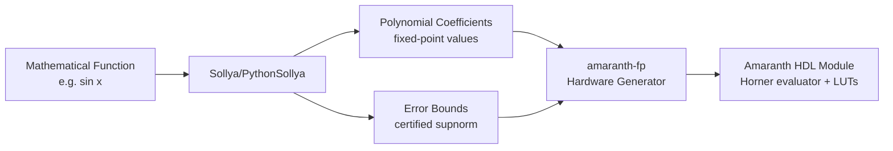
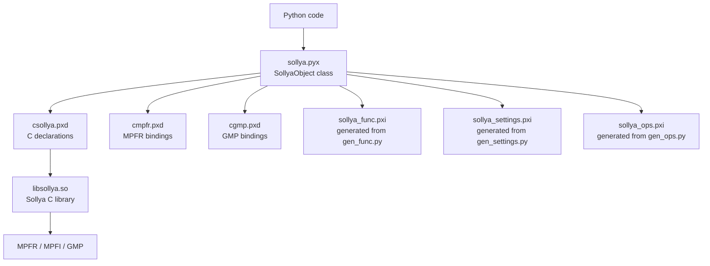
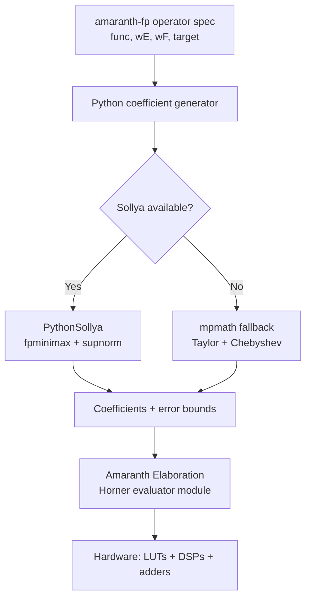

# Sollya & PythonSollya Analysis for amaranth-fp

## 1. Executive Summary

**Sollya** is a C library and interactive tool for safe floating-point code development, particularly targeted at automated implementation of mathematical floating-point libraries (libm). It provides:

- **Arbitrary-precision arithmetic** via MPFR/MPFI/GMP
- **Certified polynomial approximation** (`remez`, `fpminimax`) for generating hardware-implementable function approximations
- **Interval arithmetic** for rigorous error bounds
- **Certified infinity norm** (`infnorm`, `supnorm`) for verifying approximation quality
- **Expression/function representation** as symbolic trees that can be manipulated, differentiated, and evaluated

**PythonSollya** is a Cython binding that exposes Sollya's full C API as Pythonic objects, enabling use from Python/metalibm workflows.

**Why this matters for amaranth-fp**: To generate correct hardware FP operators (especially transcendental functions like sin, cos, exp, log), we need to compute optimal polynomial coefficients that minimize approximation error within a given precision budget. Sollya is the standard tool for this — it's what FloPoCo uses internally.



## 2. Sollya Core Capabilities

### 2.1 Source Structure

The Sollya C library ([`sollya/`](sollya/)) is approximately 100 source files. Key modules:

| File | Purpose |
|------|---------|
| [`sollya.h`](sollya/sollya.h) | Public API (~48K chars, ~1200 functions) |
| [`remez.c`](sollya/remez.c) | Remez algorithm for minimax polynomial approximation (~106K) |
| [`fpminimax.c`](sollya/fpminimax.c) | Floating-point minimax with constrained coefficient formats (~25K) |
| [`infnorm.c`](sollya/infnorm.c) | Certified infinity norm computation (~254K) |
| [`supnorm.c`](sollya/supnorm.c) | Supremum norm computation (~86K) |
| [`expression.c`](sollya/expression.c) | Symbolic expression tree representation (~346K) |
| [`polynomials.c`](sollya/polynomials.c) | Polynomial manipulation (~486K) |
| [`base-functions.c`](sollya/base-functions.c) | Elementary function evaluation (~137K) |
| [`autodiff.c`](sollya/autodiff.c) | Automatic differentiation |
| [`taylorform.c`](sollya/taylorform.c) | Taylor form computation with error bounds |
| [`chebyshevform.c`](sollya/chebyshevform.c) | Chebyshev form computation |
| [`implement.c`](sollya/implement.c) | Code generation for polynomial evaluation (~401K) |
| [`double.c`](sollya/double.c) | Double-precision specific operations |

Dependencies: GMP (arbitrary-precision integers), MPFR (arbitrary-precision floats), MPFI (arbitrary-precision intervals), fplll (lattice reduction, used in fpminimax).

### 2.2 Key Functions

#### `remez(f, n, interval)` — Minimax Polynomial Approximation

Computes the polynomial of degree ≤ n that minimizes the maximum absolute error (L∞ norm) when approximating f over the given interval. Returns a polynomial as a Sollya expression.

```
remez(sin(x), 5, Interval(-1, 1))
```

This is the classical Remez exchange algorithm. The result is a polynomial whose coefficients are in arbitrary precision — they have not yet been rounded to any hardware format.

#### `fpminimax(f, n, formats, interval)` — FP-Constrained Minimax

Like `remez`, but constrains each coefficient to be exactly representable in the specified floating-point format. This is critical for hardware: coefficients must ultimately be stored in fixed-width registers.

```python
# From pythonsollya/examples/more.py line 116:
fpminimax(exp(x), 5, [binary64]*6, Interval(-1,1))
```

Optional arguments control: rounding mode, fixed/floating point, relative/absolute error, starting polynomial.

C API signature (from [`csollya.pxd:143`](pythonsollya/csollya.pxd:143)):
```c
sollya_obj_t sollya_lib_fpminimax(sollya_obj_t f, sollya_obj_t n,
    sollya_obj_t formats, sollya_obj_t interval, ...)
```

#### `guessdegree(f, interval, epsilon)` — Degree Estimation

Estimates the polynomial degree needed to approximate f on interval with error < epsilon. Returns an interval [min_degree, max_degree].

```python
guessdegree(exp(x), Interval(-1,1), SollyaObject(2)**(-53))
```

#### `supnorm(poly, f, interval, absolute, epsilon)` — Supremum Norm

Computes a certified bound on ‖poly − f‖∞ over the interval. Returns an interval containing the true supremum norm. Essential for verifying that approximations meet accuracy targets.

#### `infnorm(f, interval)` — Infinity Norm

Computes the infinity norm (maximum absolute value) of f over the interval. Certified result.

#### `roundcoefficients(poly, formats)` — Coefficient Rounding

Rounds polynomial coefficients to specified formats:
```python
roundcoefficients(poly, [binary32, binary32, binary64, binary64])
```

#### `implementpoly(poly, ...)` — Code Generation

Generates C code implementing polynomial evaluation (Horner scheme) with proven error bounds.

### 2.3 Expression System

Sollya represents mathematical expressions as trees. Every `sollya_obj_t` can be:
- A constant (arbitrary precision via MPFR)
- The free variable `x`
- A unary/binary operation (add, mul, sin, exp, etc.)
- A polynomial (internally, a tree of add/mul/pow operations)
- An interval (pair of MPFR bounds)
- A list, string, structure, procedure, etc.

Expressions can be **decomposed** via `operator()` and `operands()`, and **constructed** via `SollyaOperator.__call__()`.

### 2.4 Precision and Rounding

Sollya maintains a global working precision (`settings.prec`, default 165 bits). All intermediate computations use at least this precision. Key concepts:

- **Working precision**: `settings.prec` — controls internal MPFR precision
- **FP formats**: `binary16`, `binary32`, `binary64`, `binary80`, `binary128` — IEEE 754 formats used as targets for coefficient rounding
- **Rounding modes**: `RN` (nearest), `RD` (down), `RU` (up), `RZ` (toward zero)
- **`round(value, format, mode)`**: Rounds to a specific format with a specific rounding mode
- **`approx(expr)`**: Forces numerical evaluation of a symbolic expression

From [`sollya.pyx:1086-1092`](pythonsollya/sollya.pyx:1086):
```python
binary16 = wrap(sollya_lib_halfprecision_obj())
binary32 = wrap(sollya_lib_single_obj())
binary64 = wrap(sollya_lib_double_obj())
binary80 = wrap(sollya_lib_doubleextended_obj())
binary128 = wrap(sollya_lib_quad_obj())
```

## 3. PythonSollya Architecture

### 3.1 Binding Mechanism

PythonSollya is a **Cython** extension module. The architecture:



Source files:
- [`sollya.pyx`](pythonsollya/sollya.pyx) — Main module: `SollyaObject` class, type conversions, callbacks (~1126 lines)
- [`csollya.pxd`](pythonsollya/csollya.pxd) — Cython declarations for `sollya.h` (~376 lines)
- [`cmpfr.pxd`](pythonsollya/cmpfr.pxd) — MPFR type/function declarations (~415 lines)
- [`cgmp.pxd`](pythonsollya/cgmp.pxd) — GMP type/function declarations (~49 lines)
- [`gen_func.py`](pythonsollya/gen_func.py) — Code generator that produces `sollya_func.pxi` (all bound functions)
- [`gen_ops.py`](pythonsollya/gen_ops.py) — Generates operator enum bindings
- [`gen_settings.py`](pythonsollya/gen_settings.py) — Generates settings properties

### 3.2 Core Class: `SollyaObject`

Defined in [`sollya.pyx:99`](pythonsollya/sollya.pyx:99). Wraps a `sollya_obj_t` (pointer to Sollya's internal object).

**Lifecycle**: Created via `wrap()` (takes ownership of a `sollya_obj_t`) or `SollyaObject(python_value)` (converts and creates new). Freed in `__dealloc__` via `sollya_lib_clear_obj()`.

**Type conversion** (`to_sollya_obj_t` at [`sollya.pyx:596`](pythonsollya/sollya.pyx:596)):

| Python Type | Sollya Conversion |
|---|---|
| `SollyaObject` | `sollya_lib_copy_obj` |
| `float` | `sollya_lib_constant_from_double` |
| `bool` | `sollya_lib_true/false` |
| `int` | `sollya_lib_constant_from_int64` |
| `None` | `sollya_lib_void` |
| `str` | `sollya_lib_string` |
| `list/tuple` | `sollya_lib_list` |
| `dict` | Sollya structure |
| `function` | `sollya_lib_externalprocedure_with_data` |
| `bigfloat.BigFloat` | `sollya_lib_constant` (from MPFR) |

**Arithmetic**: All Python operators (`+`, `-`, `*`, `/`, `**`, `abs`) are overloaded to call corresponding `sollya_lib_*` functions. Comparisons produce Sollya boolean objects evaluated via `sollya_lib_is_true`.

**Calling**: `SollyaObject.__call__` applies a Sollya function to an argument via `sollya_lib_apply`, or executes a Sollya procedure via `sollya_lib_concat`.

### 3.3 Generated Bindings

[`gen_func.py`](pythonsollya/gen_func.py) defines a `SOT` (Sollya Object Template) class and a list of ~80 function bindings. At build time, it generates Cython code for each Sollya function. Example from the list:

```python
# gen_func.py line 181
SOT(sollya_obj_t, "sollya_lib_remez",
    (sollya_obj_t, sollya_obj_t, sollya_obj_t),
    optional_inputs=[sollya_obj_t, sollya_obj_t, sollya_obj_t])
```

This generates a Python function `remez(op0, op1, op2, *opt_args)` that converts arguments, calls `sollya_lib_remez`, and wraps the result.

### 3.4 Settings

Global Sollya settings are exposed as properties on a `settings` singleton (generated by [`gen_settings.py`](pythonsollya/gen_settings.py)):

```python
settings.prec = 200          # Set working precision to 200 bits
settings.display = hexadecimal  # Display in hex
del settings.midpointmode    # Reset to default
```

Settings can also be used as a context manager:
```python
with sollya.settings(display=sollya.hexadecimal):
    print(SollyaObject(17))  # "0x1.1p4"
```

### 3.5 Custom Functions

Python functions can be registered as Sollya library functions for use in approximation:

```python
# From examples/extras/walkthrough.py line 227
def myfunction(x, diff_order, prec):
    return exp(x)

f = function(myfunction)
# f can now be used in remez(), fpminimax(), etc.
```

The callback signature is `(interval_arg, diff_order, precision) -> interval_result`, enabling Sollya to evaluate user-defined functions with interval arithmetic.

## 4. Key API Reference

### 4.1 Function Summary

All functions are accessible as `sollya.<name>()` after `import sollya`, or directly after `from sollya import *`.

**Approximation:**
| Function | Signature | Purpose |
|---|---|---|
| `remez` | `(f, degree, interval, [weight], [quality], [bound])` | Minimax polynomial (infinite precision) |
| `fpminimax` | `(f, degree_or_monomials, formats, interval, [...])` | Minimax with FP-constrained coefficients |
| `guessdegree` | `(f, interval, epsilon, [weight], [bound])` | Estimate needed polynomial degree |
| `taylor` | `(f, degree, point)` | Taylor expansion |
| `taylorform` | `(f, degree, point, [...])` | Taylor form with error bound |
| `chebyshevform` | `(f, degree, interval)` | Chebyshev form with error bound |

**Error Analysis:**
| Function | Signature | Purpose |
|---|---|---|
| `supnorm` | `(poly, f, interval, abs/rel, epsilon)` | Certified ‖poly−f‖∞ |
| `infnorm` | `(f, interval, [...])` | Certified max\|f\| |
| `dirtyinfnorm` | `(f, interval)` | Fast (non-certified) max\|f\| |
| `checkinfnorm` | `(f, interval, bound)` | Check if max\|f\| < bound |

**Polynomial Manipulation:**
| Function | Signature | Purpose |
|---|---|---|
| `degree` | `(poly)` | Polynomial degree |
| `coeff` | `(poly, i)` | i-th coefficient |
| `roundcoefficients` | `(poly, formats)` | Round each coefficient to format |
| `horner` | `(poly)` | Convert to Horner form |
| `canonical` | `(poly)` | Convert to canonical form (a₀+a₁x+...) |
| `subpoly` | `(poly, list)` | Extract sub-polynomial |
| `implementpoly` | `(poly, ...)` | Generate C code for evaluation |

**Evaluation & Arithmetic:**
| Function | Signature | Purpose |
|---|---|---|
| `evaluate` | `(f, point_or_interval)` | Evaluate f at point or over interval |
| `round` | `(value, format, rnd_mode)` | Round to FP format |
| `diff` | `(f)` | Symbolic differentiation |
| `autodiff` | `(f, degree, point)` | AD: derivatives as intervals |
| `substitute` | `(f, g)` | Compose: f(g(x)) |
| `simplify` | `(expr)` | Simplify expression |

**Math Functions (return symbolic expressions):**
`exp`, `log`, `log2`, `log10`, `sin`, `cos`, `tan`, `asin`, `acos`, `atan`, `sinh`, `cosh`, `tanh`, `asinh`, `acosh`, `atanh`, `sqrt`, `abs`, `erf`, `erfc`, `log1p`, `expm1`, `ceil`, `floor`, `nearestint`

**Constants & Formats:**
- `pi`, `x` (free variable)
- `binary16`, `binary32`, `binary64`, `binary80`, `binary128`
- `RN`, `RD`, `RU`, `RZ`
- `absolute`, `relative`

### 4.2 Usage Patterns

**Basic evaluation** (from [`examples/intro.py`](pythonsollya/examples/intro.py)):
```python
import sollya
from sollya import *

# Round pi to various formats
round(sollya.pi, binary16, RN)   # 3.140625
round(sollya.pi, binary64, RN)   # 3.14159265358979...

# Symbolic expressions are not auto-evaluated
exp(1)          # "exp(1)" — symbolic
exp(1).approx() # 2.71828... — numerically evaluated
```

**Polynomial approximation** (from [`examples/more.py:116`](pythonsollya/examples/more.py:116)):
```python
# Compute degree-5 minimax of exp(x) on [-1,1] with binary64 coefficients
poly = fpminimax(exp(x), 5, [binary64]*6, Interval(-1,1))
```

**Interval arithmetic**:
```python
evaluate(sin(x)/x, Interval(-1,1))  # [0.5403...;1]
1 in Interval(0, 3)                  # True
```

**Automatic differentiation**:
```python
l = autodiff(exp(cos(x)) + sin(exp(x)), 5, 0)
# l[k] = k-th derivative at x=0, as an interval
```

## 5. Polynomial Approximation Workflow

This is the most important workflow for hardware FP generation. Step by step:

### Step 1: Define the Function and Domain

```python
from sollya import *
f = sin(x)                    # the function to approximate
dom = Interval(0, pi/4)       # the domain (after range reduction)
```

### Step 2: Estimate Required Degree

```python
target_error = SollyaObject(2)**(-24)  # ~1 ULP for float32 mantissa
deg = guessdegree(f, dom, target_error)
# Returns interval, e.g. [5;5] meaning degree 5 is sufficient
n = int(sup(deg))
```

### Step 3: Compute Minimax Polynomial (Infinite Precision)

```python
poly_exact = remez(f, n, dom)
# poly_exact has arbitrary-precision rational coefficients
```

### Step 4: Constrain Coefficients to Hardware Formats

```python
# For hardware: coefficients must be fixed-width
# Specify format per coefficient (can mix formats)
formats = [binary32] * (n + 1)
poly_hw = fpminimax(f, n, formats, dom)
```

Or with more control:
```python
poly_hw = fpminimax(f, n, formats, dom, relative, floating,
                    poly_exact)  # use remez result as starting point
```

### Step 5: Verify Approximation Error

```python
err = supnorm(poly_hw, f, dom, absolute, SollyaObject(2)**(-60))
# Returns certified interval containing the true sup-norm
print("Approximation error:", err)
```

### Step 6: Extract Coefficients for Hardware

```python
for i in range(int(degree(poly_hw)) + 1):
    ci = coeff(poly_hw, i)
    # Convert to Python float or integer mantissa for hardware
    print(f"c[{i}] = {float(ci)}")
    # Or get exact double representation:
    ci_double = round(ci, binary64, RN)
```

### Step 7: Choose Evaluation Scheme

For hardware, Horner form is standard (minimizes multiplications):
```python
poly_horner = horner(poly_hw)
# Result: c0 + x*(c1 + x*(c2 + x*(...)))
```

### Complete Example

```python
from sollya import *

settings.prec = 200  # high working precision

f = sin(x)
dom = Interval(0, pi/4)

# Guess degree for 24-bit accuracy
deg = guessdegree(f, dom, SollyaObject(2)**(-24))
n = int(sup(deg))

# Get FP-constrained polynomial
formats = [binary32] * (n + 1)
poly = fpminimax(f, n, formats, dom)

# Verify
err = supnorm(poly, f, dom, absolute, SollyaObject(2)**(-50))
print("Max error:", err)

# Extract coefficients
for i in range(n + 1):
    c = coeff(poly, i)
    print(f"  c[{i}] = {float(c):#.10e}")
```

## 6. Precision and Rounding

### 6.1 Working Precision

Sollya uses MPFR for all internal arithmetic. The global `settings.prec` (default 165 bits) controls the minimum precision of computations. Key points:

- `remez` and `fpminimax` use working precision for internal iterations but the **output polynomial is symbolic** — coefficients are exact rational expressions until explicitly rounded
- `evaluate(f, point)` returns a result at working precision
- `evaluate(f, interval)` uses interval arithmetic via MPFI, returning rigorous enclosures

### 6.2 Format Objects

Sollya represents IEEE 754 formats as objects that encode (exponent_bits, mantissa_bits):

| Object | IEEE Name | Mantissa Bits | Exponent Bits |
|---|---|---|---|
| `binary16` | Half | 11 | 5 |
| `binary32` | Single | 24 | 8 |
| `binary64` | Double | 53 | 11 |
| `binary80` | Extended | 64 | 15 |
| `binary128` | Quad | 113 | 15 |

Custom precision can be specified as an integer (number of mantissa bits):
```python
roundcoefficients(poly, [24, 24, 16, 16])  # custom mantissa widths
```

### 6.3 Rounding Modes

From [`sollya.pyx:1068-1071`](pythonsollya/sollya.pyx:1068):
```python
RD = round_down()          # toward -∞
RU = round_up()            # toward +∞
RZ = round_towards_zero()  # toward 0
RN = round_to_nearest()    # ties to even
```

### 6.4 `honorcoeffprec` Mode

When `fpminimax` is called with `honorcoeffprec`, it respects the precision of each coefficient format individually. This is important when mixing formats.

## 7. Integration Points for amaranth-fp

### 7.1 Generating LUT Contents

For table-based methods (bipartite tables, multipartite), Sollya evaluates the target function at each LUT input:

```python
settings.prec = 128
num_entries = 2**input_bits
for i in range(num_entries):
    x_val = domain_lo + i * (domain_hi - domain_lo) / num_entries
    y_val = round(evaluate(f, SollyaObject(x_val)), SollyaObject(output_bits), RN)
    lut_contents.append(int(y_val))
```

### 7.2 Computing Polynomial Coefficients

The primary use case. For each fixed-point polynomial evaluator segment:

```python
def compute_coefficients(func, domain, degree, coeff_bits):
    """Compute polynomial coefficients for hardware implementation."""
    formats = [SollyaObject(coeff_bits)] * (degree + 1)
    poly = fpminimax(func, degree, formats, domain,
                     absolute, fixed)  # fixed-point coefficients
    coeffs = []
    for i in range(degree + 1):
        c = coeff(poly, i)
        coeffs.append(int(c * SollyaObject(2)**coeff_bits))
    return coeffs
```

### 7.3 Verifying Numerical Accuracy

After generating a hardware design, verify that the polynomial + evaluation scheme meets accuracy targets:

```python
# poly_with_errors accounts for rounding in the Horner evaluation
total_error = supnorm(poly, target_func, domain, absolute,
                      SollyaObject(2)**(-100))
assert float(sup(total_error)) < target_accuracy
```

### 7.4 Computing Constants at Arbitrary Precision

```python
# Get log(2) at 128-bit precision
settings.prec = 128
log2_val = round(log(SollyaObject(2)), SollyaObject(128), RN)

# Get pi at arbitrary bit width
pi_fixedpoint = int(round(pi, SollyaObject(64), RN) * SollyaObject(2)**62)
```

### 7.5 Integration Architecture



## 8. Alternatives and Fallbacks

If Sollya/PythonSollya is not available (complex build dependencies: GMP, MPFR, MPFI, fplll), alternatives exist:

### 8.1 `mpmath` (Pure Python)

```python
import mpmath
mpmath.mp.prec = 200

# Taylor coefficients
def taylor_coeffs(f, n, x0=0):
    return [mpmath.taylor(f, x0, n)[i] for i in range(n+1)]

# Chebyshev approximation
from mpmath import chebyfit
coeffs = chebyfit(mpmath.sin, [0, mpmath.pi/4], 5, error=True)
```

**Pros**: Pure Python, easy to install, arbitrary precision.
**Cons**: No minimax (Remez) algorithm, no `fpminimax` equivalent, no certified error bounds. Chebyshev approximation is near-minimax but not optimal.

### 8.2 `numpy.polynomial`

```python
import numpy.polynomial.chebyshev as C
# Chebyshev interpolation (not minimax)
coeffs = C.chebinterpolate(np.sin, 5)
```

**Cons**: Only hardware double precision, no certified bounds.

### 8.3 Custom Remez Implementation

For a self-contained amaranth-fp, we could implement a basic Remez algorithm using `mpmath`:

```python
def simple_remez(f, n, a, b, prec=100):
    """Basic Remez exchange algorithm using mpmath."""
    mp.prec = prec
    # Initialize with Chebyshev nodes
    # ... iterative exchange ...
    return polynomial_coefficients
```

This is feasible but significant work for a certified implementation.

### 8.4 Recommended Strategy

1. **Primary**: Use PythonSollya when available — it gives optimal results with certified bounds
2. **Fallback**: Use `mpmath` Chebyshev approximation — near-optimal, easy to install
3. **Detect at import time**: Check for `sollya` module availability and fall back gracefully

```python
try:
    import sollya
    from sollya import *
    HAS_SOLLYA = True
except ImportError:
    HAS_SOLLYA = False
    import mpmath  # fallback
```

## Appendix: PythonSollya Object Conversion Cheat Sheet

| To get... | From SollyaObject `s` | Notes |
|---|---|---|
| Python `float` | `float(s)` | May lose precision |
| Python `int` | `int(s)` | Exact if value is integer |
| Python `bool` | `bool(s)` | Only for boolean objects |
| Python `list` | `list(s)` or `s.list()` | For Sollya lists |
| Evaluated number | `s.approx()` | Returns SollyaObject at working prec |
| `bigfloat.BigFloat` | `s.bigfloat()` | Full-precision MPFR value |
| Coefficient i | `coeff(s, i)` | For polynomials |
| Interval bounds | `inf(s)`, `sup(s)`, `mid(s)` | For intervals/ranges |
| String repr | `repr(s)` | Valid Sollya syntax |
