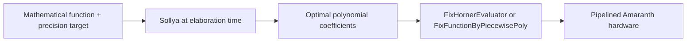
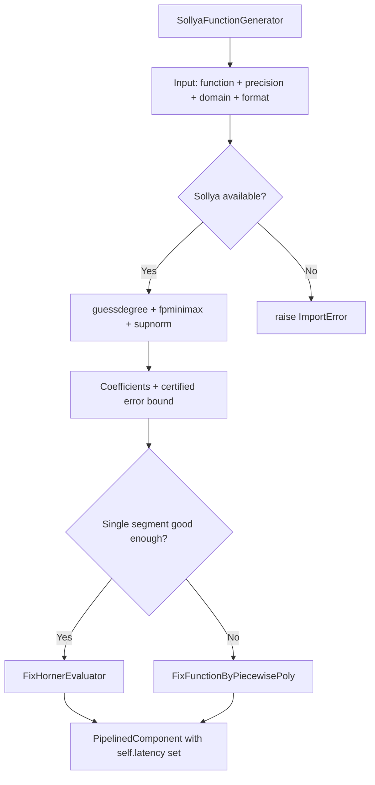
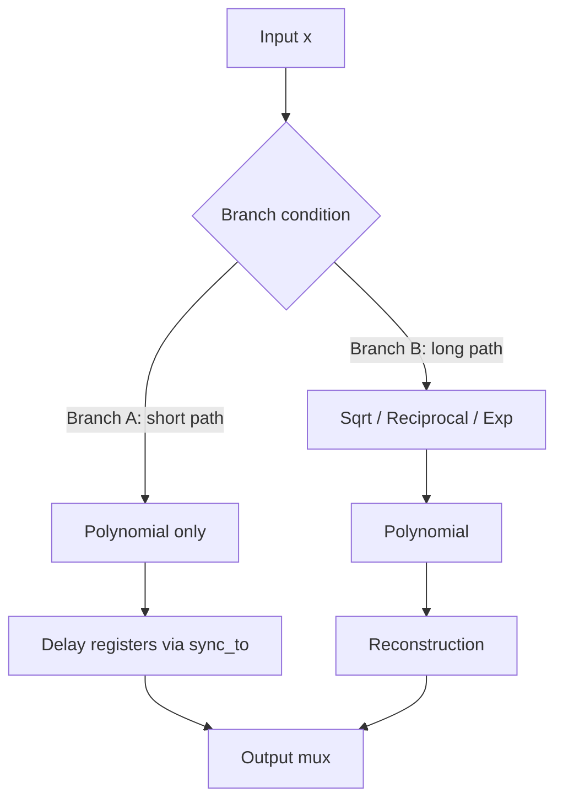
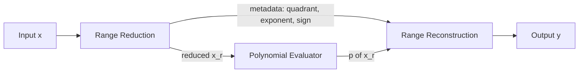

# Sollya-Generated Mathematical Function Library for amaranth-fp

## 1. Overview

This document describes how to use Sollya's `fpminimax` polynomial approximation to generate hardware implementations of mathematical functions in amaranth-fp.

### Core Pattern



The workflow for every function is:

1. **Range reduction** — map arbitrary input to a small interval where polynomials converge quickly
2. **Polynomial approximation** — use `sollya.guessdegree()` then `sollya.fpminimax()` to find optimal coefficients
3. **Horner evaluation** — feed coefficients into [`FixHornerEvaluator`](../src/amaranth_fp/functions/fix_horner.py) or [`FixFunctionByPiecewisePoly`](../src/amaranth_fp/functions/fix_function_by_poly.py)
4. **Range reconstruction** — undo the range reduction with additional hardware

### Precision Targets

| Name | Mantissa bits | Target error | Sollya format |
|------|--------------|--------------|---------------|
| Half | 11 | 2^-11 | `binary16` |
| Single | 24 | 2^-24 | `binary32` |
| Double | 53 | 2^-53 | `binary64` |

### Existing Building Blocks

| Module | Purpose |
|--------|---------|
| [`FixHornerEvaluator`](../src/amaranth_fp/functions/fix_horner.py) | Pipelined Horner polynomial evaluation with fixed coefficients |
| [`FixFunctionByPiecewisePoly`](../src/amaranth_fp/functions/fix_function_by_poly.py) | Piecewise polynomial with ROM-based coefficient lookup |
| [`FixFunctionByTable`](../src/amaranth_fp/functions/fix_function_by_table.py) | Direct table lookup |
| [`Table`](../src/amaranth_fp/functions/table.py) | ROM table primitive |
| [`FixSinCosPoly`](../src/amaranth_fp/operators/fix_sincos_poly.py) | Existing polynomial sin/cos reference |
| [`FixSinCos`](../src/amaranth_fp/operators/fix_sincos.py) | CORDIC-based sin/cos |

---

## 2. Module Organization

Functions are split into two sub-modules based on domain:

### 2.1 Math Primitives — `amaranth_fp/functions/math/`

Pure mathematical functions. Tier rankings are by mathematical importance and foundational utility.

| Tier | Functions |
|------|-----------|
| Tier 1 — Foundational | `exp2`, `log2`, `reciprocal`, `rsqrt` |
| Tier 2 — Core math | `atan`, `asin`, `erf`, `exp10`, `log10`, `cbrt` |
| Tier 3 — Derived | `acos`, `sinh`, `cosh`, `tanh`, `asinh`, `acosh`, `atanh`, `erfc` |

### 2.2 ML Activations — `amaranth_fp/functions/ml/`

ML activation functions. Tier rankings are by ML framework usage frequency.

| Tier | Functions |
|------|-----------|
| Tier 1 — Ubiquitous | `sigmoid`, `GELU`, `swish` |
| Tier 2 — Common | `tanh` (re-exported from math), `softplus`, `mish` |
| Tier 3 — Specialized | `sinc` |

Each sub-module has its own `__init__.py` exporting its functions.

### Directory Structure

```
amaranth_fp/functions/
├── math/
│   ├── __init__.py
│   ├── asin.py
│   ├── acos.py
│   ├── atan.py
│   ├── sinh.py
│   ├── cosh.py
│   ├── tanh.py
│   ├── asinh.py
│   ├── acosh.py
│   ├── atanh.py
│   ├── erf.py
│   ├── erfc.py
│   ├── log2.py
│   ├── log10.py
│   ├── exp2.py
│   ├── exp10.py
│   ├── cbrt.py
│   ├── reciprocal.py
│   └── rsqrt.py
├── ml/
│   ├── __init__.py
│   ├── sigmoid.py
│   ├── gelu.py
│   ├── sinc.py
│   ├── softplus.py
│   ├── swish.py
│   └── mish.py
├── fix_horner.py
├── fix_function_by_poly.py
└── ...  (existing shared building blocks)
```

---

## 3. Function Catalog

### 3.1 Math Primitives

#### `asin(x)` — Arc Sine

- **Definition**: inverse of sin, returns angle in [-π/2, π/2]
- **Domain**: [-1, 1]
- **Range**: [-π/2, π/2]
- **Range reduction**: Two branches:
  - **Branch A** (|x| ≤ 0.5): Direct polynomial on [-0.5, 0.5]. Latency = N cycles (Horner only).
  - **Branch B** (|x| > 0.5): asin(x) = π/2 - 2·asin(sqrt((1-x)/2)). Requires sqrt → polynomial → scale. Latency = N + FPSqrt.latency cycles.
- **Branch latency equalization**: Branch A is shorter. Pad Branch A with delay registers using `sync_to()` to match Branch B's latency. See §4.2 for the general pattern.
- **Polynomial degree** (on [-0.5, 0.5]):
  - Half: 3-4
  - Single: 7-9
  - Double: 17-19
- **Special cases**: asin(±1) = ±π/2, asin(0) = 0. Near ±1 the derivative is infinite — range reduction is essential.
- **Building blocks**: `FixFunctionByPiecewisePoly` for core polynomial + square root operator for range reduction + constant multiplier for π/2
- **Latency**: `range_reduction_stages + horner_stages + range_reconstruction_stages` (Branch B path determines total)
- **Sollya code**:
  ```
  f = asin(x);
  dom = [-0.5, 0.5];
  deg = guessdegree(f, dom, 2^(-24));
  poly = fpminimax(f, deg, [|binary32...|], dom, absolute, floating);
  ```

#### `acos(x)` — Arc Cosine

- **Definition**: acos(x) = π/2 - asin(x)
- **Domain**: [-1, 1]
- **Range**: [0, π]
- **Range reduction**: Derive from asin: acos(x) = π/2 - asin(x). No separate approximation needed.
- **Special cases**: acos(1) = 0, acos(-1) = π, acos(0) = π/2
- **Building blocks**: Reuse `asin` + subtractor + π/2 constant

#### `atan(x)` — Arc Tangent

- **Definition**: inverse of tan, returns angle in (-π/2, π/2)
- **Domain**: (-∞, +∞)
- **Range**: (-π/2, π/2)
- **Range reduction**: Two branches:
  - **Branch A** (|x| ≤ 1): Direct polynomial on [-1, 1].
  - **Branch B** (|x| > 1): atan(x) = π/2 - atan(1/x). Requires reciprocal → polynomial → subtract.
- **Branch latency equalization**: Apply `sync_to()` on the shorter branch to match the longer branch. See §4.2.
- **Polynomial degree** (on [-1, 1]):
  - Half: 5-7
  - Single: 11-13
  - Double: 25-27
- **Special cases**: atan(0) = 0, atan(±∞) = ±π/2
- **Building blocks**: `FixFunctionByPiecewisePoly` + reciprocal for |x|>1 reduction + constant table for atan(a_i)
- **Sollya code**:
  ```
  f = atan(x);
  dom = [0, 1];
  deg = guessdegree(f, dom, 2^(-24));
  poly = fpminimax(f, deg, [|binary32...|], dom, absolute, floating);
  ```

---

#### `sinh(x)` — Hyperbolic Sine

- **Definition**: (exp(x) - exp(-x)) / 2
- **Domain**: (-∞, +∞)
- **Range**: (-∞, +∞)
- **Range reduction**: Two branches:
  - **Branch A** (|x| < 1): Direct odd polynomial. Latency = Horner stages.
  - **Branch B** (|x| ≥ 1): Use (exp(x) - exp(-x))/2 with existing `FPExp`. Latency = FPExp.latency + subtractor + shift.
- **Branch latency equalization**: Apply `sync_to()` on Branch A. See §4.2.
- **Polynomial degree** (on [-1, 1]):
  - Half: 3
  - Single: 7
  - Double: 15
- **Special cases**: sinh(0) = 0, overflow for large |x|
- **Building blocks**: `FixHornerEvaluator` for small x, `FPExp` for large x
- **Sollya code**:
  ```
  f = sinh(x);
  dom = [-1, 1];
  deg = guessdegree(f, dom, 2^(-24));
  poly = fpminimax(f, deg, [|binary32...|], dom, absolute, floating);
  ```

#### `cosh(x)` — Hyperbolic Cosine

- **Definition**: (exp(x) + exp(-x)) / 2
- **Domain**: (-∞, +∞)
- **Range**: [1, +∞)
- **Range reduction**: cosh is even: cosh(x) = cosh(|x|). Two branches similar to sinh: polynomial for small |x|, exp-based for large |x|.
- **Branch latency equalization**: Same pattern as sinh. See §4.2.
- **Polynomial degree** (on [0, 1]):
  - Half: 2-3
  - Single: 6
  - Double: 13
- **Special cases**: cosh(0) = 1
- **Building blocks**: Same as sinh

#### `tanh(x)` — Hyperbolic Tangent

- **Definition**: sinh(x) / cosh(x)
- **Domain**: (-∞, +∞)
- **Range**: (-1, 1)
- **Range reduction**: tanh is odd. For |x| > ~4 (single), tanh ≈ ±1 (saturates). For small |x|, direct polynomial. For medium |x|, use tanh(x) = 1 - 2/(exp(2x)+1).
- **Polynomial degree** (on [0, 1]):
  - Half: 3
  - Single: 7-9
  - Double: 17-19
- **Special cases**: tanh(0) = 0, tanh(±∞) = ±1
- **Building blocks**: `FixFunctionByPiecewisePoly` for core, saturation logic for large |x|
- **Sollya code**:
  ```
  f = tanh(x);
  dom = [0, 4];
  deg = guessdegree(f, [0, 1], 2^(-24));
  poly = fpminimax(f, deg, [|binary32...|], [0,1], absolute, floating);
  ```

---

#### `asinh(x)` — Inverse Hyperbolic Sine

- **Definition**: log(x + sqrt(x^2 + 1))
- **Domain**: (-∞, +∞)
- **Range**: (-∞, +∞)
- **Range reduction**: asinh is odd. Two branches:
  - **Branch A** (|x| < 0.5): Direct polynomial.
  - **Branch B** (|x| ≥ 0.5): asinh(x) ≈ sign(x)·(log(2|x|)) using existing log.
- **Branch latency equalization**: Apply `sync_to()` on the shorter branch. See §4.2.
- **Polynomial degree** (on [-0.5, 0.5]):
  - Half: 3
  - Single: 7
  - Double: 15
- **Special cases**: asinh(0) = 0
- **Building blocks**: `FixHornerEvaluator` for small x, `FPLog` + `FPSqrt` for large x

#### `acosh(x)` — Inverse Hyperbolic Cosine

- **Definition**: log(x + sqrt(x^2 - 1))
- **Domain**: [1, +∞)
- **Range**: [0, +∞)
- **Range reduction**: For x near 1, use acosh(x) = sqrt(2(x-1))·(1 + series in (x-1)). For large x, acosh(x) ≈ log(2x).
- **Polynomial degree** (on [1, 2]):
  - Half: 4
  - Single: 9
  - Double: 19
- **Special cases**: acosh(1) = 0
- **Building blocks**: `FPLog` + `FPSqrt`

#### `atanh(x)` — Inverse Hyperbolic Tangent

- **Definition**: 0.5 · log((1+x)/(1-x))
- **Domain**: (-1, 1)
- **Range**: (-∞, +∞)
- **Range reduction**: atanh is odd. Two branches:
  - **Branch A** (|x| < 0.5): Direct polynomial (odd terms).
  - **Branch B** (|x| ≥ 0.5): Must use log form.
- **Branch latency equalization**: Apply `sync_to()` on the shorter branch. See §4.2.
- **Polynomial degree** (on [-0.5, 0.5]):
  - Half: 3
  - Single: 9
  - Double: 19
- **Special cases**: atanh(0) = 0, atanh(±1) = ±∞
- **Building blocks**: `FixHornerEvaluator` for small x, `FPLog` for x near ±1

---

#### `erf(x)` — Error Function

- **Definition**: (2/√π) · ∫₀ˣ exp(-t²) dt
- **Domain**: (-∞, +∞)
- **Range**: (-1, 1)
- **Range reduction**: erf is odd. For |x| > ~4, erf ≈ ±1. For |x| < 1, direct polynomial. For 1 < |x| < 4, piecewise polynomial.
- **Polynomial degree** (on [0, 1]):
  - Half: 3-5
  - Single: 9-11
  - Double: 21-23
- **Special cases**: erf(0) = 0, erf(±∞) = ±1
- **Building blocks**: `FixFunctionByPiecewisePoly` with saturation logic
- **Sollya code**:
  ```
  f = erf(x);
  dom = [0, 1];
  deg = guessdegree(f, dom, 2^(-24));
  poly = fpminimax(f, deg, [|binary32...|], dom, absolute, floating);
  ```

#### `erfc(x)` — Complementary Error Function

- **Definition**: 1 - erf(x)
- **Domain**: (-∞, +∞)
- **Range**: (0, 2)
- **Range reduction**: For large x, erfc(x) ≈ exp(-x²)/(x·√π) · series. Direct subtraction loses precision for large x. Approximate erfc directly for x > 1.
- **Polynomial degree** (on [0, 1]):
  - Half: 3-5
  - Single: 9-11
  - Double: 21-23
- **Special cases**: erfc(0) = 1
- **Building blocks**: Separate polynomial for erfc directly (not 1-erf) for large x

---

#### `log2(x)` — Base-2 Logarithm

- **Definition**: log(x) / log(2) = log₂(x)
- **Domain**: (0, +∞)
- **Range**: (-∞, +∞)
- **Range reduction**: x = 2^e · m where m ∈ [1, 2). Then log2(x) = e + log2(m). Only need to approximate log2 on [1, 2).
- **Polynomial degree** (on [1, 2]):
  - Half: 4-5
  - Single: 9-10
  - Double: 20-22
- **Special cases**: log2(1) = 0, log2(2) = 1, log2(0) = -∞, log2(negative) = NaN
- **Building blocks**: Exponent extraction + `FixFunctionByPiecewisePoly` on [1,2) + integer adder
- **Sollya code**:
  ```
  f = log2(1 + x);
  dom = [0, 1];
  deg = guessdegree(f, dom, 2^(-24));
  poly = fpminimax(f, deg, [|binary32...|], dom, absolute, floating);
  ```

#### `log10(x)` — Base-10 Logarithm

- **Definition**: log(x) / log(10) = log₁₀(x)
- **Domain**: (0, +∞)
- **Range**: (-∞, +∞)
- **Range reduction**: log10(x) = log2(x) / log2(10) = log2(x) · log10(2). Reuse log2 + constant multiplier.
- **Building blocks**: `log2` + constant multiplier by log10(2) ≈ 0.30103

---

#### `exp2(x)` — Base-2 Exponential

- **Definition**: 2^x
- **Domain**: (-∞, +∞)
- **Range**: (0, +∞)
- **Range reduction**: x = n + f where n = floor(x), f ∈ [0, 1). Then 2^x = 2^n · 2^f. Only need to approximate 2^f on [0, 1). 2^n is a shift.
- **Polynomial degree** (on [0, 1]):
  - Half: 3-4
  - Single: 7-8
  - Double: 15-16
- **Special cases**: exp2(0) = 1, exp2(1) = 2
- **Building blocks**: Shifter for 2^n + `FixHornerEvaluator` for 2^f
- **Sollya code**:
  ```
  f = 2^x - 1;
  dom = [0, 1];
  deg = guessdegree(f, dom, 2^(-24));
  poly = fpminimax(f, deg, [|binary32...|], dom, absolute, floating);
  ```

#### `exp10(x)` — Base-10 Exponential

- **Definition**: 10^x
- **Domain**: (-∞, +∞)
- **Range**: (0, +∞)
- **Range reduction**: 10^x = 2^(x · log2(10)). Reuse exp2 after multiplying by log2(10) ≈ 3.32193.
- **Building blocks**: Constant multiplier + `exp2`

---

#### `cbrt(x)` — Cube Root

- **Definition**: x^(1/3)
- **Domain**: (-∞, +∞)
- **Range**: (-∞, +∞)
- **Range reduction**: x = 2^(3k+r) · m, r ∈ {0,1,2}, m ∈ [1, 2). cbrt(x) = 2^k · cbrt(2^r) · cbrt(m). Need polynomial for cbrt on [1, 2), times a small lookup for cbrt(1), cbrt(2), cbrt(4).
- **Polynomial degree** (on [1, 2]):
  - Half: 3-4
  - Single: 7-8
  - Double: 15-16
- **Special cases**: cbrt(0) = 0, cbrt(negative) = -cbrt(|x|)
- **Building blocks**: Exponent manipulation + small LUT + `FixHornerEvaluator` on [1,2)

#### `reciprocal(x)` — 1/x

- **Definition**: 1/x
- **Domain**: x ≠ 0
- **Range reduction**: Normalize to [1, 2), compute 1/m via polynomial, adjust exponent.
- **Polynomial degree** (on [1, 2]):
  - Half: 3
  - Single: 7
  - Double: 15
- **Alternative**: Newton-Raphson iteration: y_{n+1} = y_n · (2 - x · y_n). Initial guess from LUT.
- **Building blocks**: `FixFunctionByPiecewisePoly` or Newton iteration with `FPMul`

#### `rsqrt(x)` — 1/√x

- **Definition**: x^(-1/2)
- **Domain**: (0, +∞)
- **Range**: (0, +∞)
- **Range reduction**: Same as sqrt — normalize mantissa to [1, 4), halve exponent.
- **Polynomial degree** (on [1, 2]):
  - Half: 2-3
  - Single: 5-6
  - Double: 12-13
- **Alternative**: Newton-Raphson: y_{n+1} = y_n/2 · (3 - x · y_n²). Famous from Quake III fast inverse sqrt.
- **Building blocks**: LUT initial guess + 1-2 Newton iterations with `FPMul`

---

### 3.2 ML Activation Functions

#### `sigmoid(x)` — Logistic Function

- **Definition**: 1 / (1 + exp(-x))
- **Domain**: (-∞, +∞)
- **Range**: (0, 1)
- **Range reduction**: sigmoid is symmetric: sigmoid(-x) = 1 - sigmoid(x). For |x| > 8, sigmoid ≈ 0 or 1. Approximate on [0, 8].
- **Polynomial degree** (on [0, 4], piecewise):
  - Half: 3-4 per segment
  - Single: 5-7 per segment
  - Double: 11-13 per segment
- **Special cases**: sigmoid(0) = 0.5, saturation for large |x|
- **Building blocks**: `FixFunctionByPiecewisePoly` with 4-8 segments + saturation logic
- **Sollya code**:
  ```
  f = 1/(1 + exp(-x));
  dom = [0, 8];
  deg = guessdegree(f, dom, 2^(-11));
  poly = fpminimax(f, deg, [|binary16...|], dom, absolute, floating);
  ```

#### `GELU(x)` — Gaussian Error Linear Unit

- **Definition**: x · Φ(x) = x/2 · (1 + erf(x/√2))
- **Domain**: (-∞, +∞)
- **Range**: (-0.17..., +∞)
- **Range reduction**: GELU is approximately: GELU(x) ≈ x·sigmoid(1.702x) for a fast approximation. Alternatively, use the exact form with erf.
- **Polynomial degree** (on [-4, 4], piecewise):
  - Half: 3-4 per segment
  - Single: 7-9 per segment
- **Building blocks**: `erf` + multiplier, or direct piecewise polynomial via `FixFunctionByPiecewisePoly`

#### `sinc(x)` — Cardinal Sine

- **Definition**: sin(x)/x, sinc(0) = 1
- **Domain**: (-∞, +∞)
- **Range**: [-0.2172..., 1]
- **Range reduction**: sinc is even. For small |x|, polynomial (1 - x²/6 + x⁴/120 - ...). For large |x|, use sin(x)/x directly.
- **Polynomial degree** (on [0, π]):
  - Half: 4-5
  - Single: 9-11
  - Double: 19-21
- **Special cases**: sinc(0) = 1 (removable singularity — handle in hardware with x==0 mux)
- **Building blocks**: `FixFunctionByPiecewisePoly` + zero-detect mux

#### `softplus(x)` — Softplus

- **Definition**: log(1 + exp(x))
- **Domain**: (-∞, +∞)
- **Range**: (0, +∞)
- **Range reduction**: For large x, softplus(x) ≈ x. For large negative x, softplus(x) ≈ exp(x). Core approximation on [-4, 4].
- **Building blocks**: `FixFunctionByPiecewisePoly` + saturation logic

#### `swish(x)` — Swish / SiLU

- **Definition**: x · sigmoid(x)
- **Domain**: (-∞, +∞)
- **Range**: (-0.278..., +∞)
- **Building blocks**: `sigmoid` + multiplier

#### `mish(x)` — Mish

- **Definition**: x · tanh(softplus(x))
- **Domain**: (-∞, +∞)
- **Range**: (-0.309..., +∞)
- **Building blocks**: `softplus` + `tanh` + multiplier, or direct piecewise polynomial

---

## 4. Implementation Architecture

### 4.1 SollyaFunctionGenerator Class

A Python class that runs at elaboration time to compute polynomial coefficients and produce Amaranth hardware. **Sollya is a hard requirement** — there is no fallback. The coefficients computed by Sollya are mathematically proven correct via `supnorm` certification. Any alternative (e.g., mpmath Chebyshev fitting) would produce approximations without certified error bounds, silently generating incorrect hardware.



If Sollya is not installed, the constructor raises `ImportError` immediately:

```python
class SollyaFunctionGenerator:
    def __init__(self,
        func: str,              # Sollya expression, e.g. "sin(x)"
        domain: tuple,          # (lo, hi)
        precision_bits: int,    # target mantissa bits
        max_degree: int = 32,
        num_segments: int = 1,  # >1 for piecewise
        coeff_format: ...,      # FixedPointFormat or Sollya format string
    ):
        try:
            import sollya
        except ImportError:
            raise ImportError(
                "Sollya is required for SollyaFunctionGenerator. "
                "Install pythonsollya: https://gitlab.com/metalibm-dev/pythonsollya\n"
                "Sollya provides certified polynomial approximations with proven error bounds. "
                "There is no fallback — mpmath approximations are NOT equivalent and would "
                "silently produce incorrect hardware."
            )
        ...
```

**Rationale**: Sollya's `fpminimax` produces minimax polynomials with `supnorm`-certified error bounds. An mpmath-based Chebyshev fit cannot certify that the approximation error is below the target — it can only estimate it numerically. For hardware that must meet a precision specification, uncertified coefficients are unacceptable.

### 4.2 Branch Latency Equalization

**Problem**: Functions with branching range reduction (asin, atan, sinh, asinh, atanh, etc.) have two code paths with different latencies. `PipelinedComponent` requires fixed, deterministic latency — every input must produce its output after exactly the same number of clock cycles.

**Solution**: Pad the shorter branch with delay registers to match the longer branch's latency.



**Pattern**: In the Amaranth `elaborate()` method:

```python
# Branch A: short path (e.g., direct polynomial for |x| <= 0.5)
branch_a_result = horner_a.output  # ready at cycle N

# Branch B: long path (e.g., sqrt -> polynomial -> scale for |x| > 0.5)
branch_b_result = reconstruction.output  # ready at cycle N + K

# Equalize: delay Branch A by K cycles
branch_a_delayed = Signal.like(branch_a_result)
# Insert K pipeline registers (sync_to or explicit shift register)
m.d.sync += branch_a_delayed.eq(branch_a_result)  # repeated K times

# Mux at the equalized point
with m.If(branch_select_delayed):  # branch_select also delayed K cycles
    m.d.comb += output.eq(branch_b_result)
with m.Else():
    m.d.comb += output.eq(branch_a_delayed)
```

**Functions requiring branch latency equalization**:
- `asin` — sqrt branch vs. direct polynomial
- `atan` — reciprocal branch vs. direct polynomial
- `sinh`, `cosh` — exp branch vs. direct polynomial
- `asinh` — log branch vs. direct polynomial
- `atanh` — log branch vs. direct polynomial

### 4.3 FixedPointFormat and create_module() Signature

The `create_module()` method accepts `FixedPointFormat` descriptors instead of raw bit widths. This gives `FixHornerEvaluator` the binary point position needed to scale coefficients correctly.

```python
from dataclasses import dataclass

@dataclass(frozen=True)
class FixedPointFormat:
    signed: bool
    int_bits: int
    frac_bits: int

    @property
    def total_bits(self) -> int:
        return (1 if self.signed else 0) + self.int_bits + self.frac_bits
```

The `create_module()` signature:

```python
def create_module(self,
                  input_format: FixedPointFormat,
                  output_format: FixedPointFormat,
                  ) -> PipelinedComponent:
    """Return a PipelinedComponent with self.latency correctly set.

    Args:
        input_format: Fixed-point format of the input signal,
            specifying signedness, integer bits, and fractional bits.
        output_format: Fixed-point format of the output signal.

    Returns:
        A PipelinedComponent whose .latency attribute reflects the
        total pipeline depth: range_reduction_stages + horner_stages
        + range_reconstruction_stages.
    """
    ...
```

**Why not `input_width`/`output_width`?** A 16-bit input could be Q1.15, Q4.12, or Q8.8 — the Horner evaluator needs to know where the binary point is to scale the Sollya-computed coefficients into the correct fixed-point representation.

### 4.4 Coefficient Caching

Since Sollya computation can be slow (seconds per call), coefficients are cached. The cache key **must include the coefficient format** to prevent sharing results between incompatible representations.

```python
CoefficientCacheKey = tuple[str, tuple, int, int, object]
# (func_name, domain, precision_bits, num_segments, coeff_format)

COEFFICIENT_CACHE: dict[CoefficientCacheKey, list[list[int]]] = {}

def _cache_key(self) -> CoefficientCacheKey:
    return (
        self.func,
        self.domain,
        self.precision_bits,
        self.num_segments,
        self.coeff_format,  # FixedPointFormat or format string
    )
```

The `coeff_format` field is critical: two calls requesting the same function at the same precision but with different fixed-point formats (e.g., `binary16` vs. `(signed=True, int_bits=2, frac_bits=14)`) produce different integer coefficient values. Without this field in the key, the cache would silently return wrong coefficients.

### 4.5 Latency Propagation

Every module returned by `create_module()` is a `PipelinedComponent` with `self.latency` correctly set. The latency is deterministic and computed at elaboration time:

```
total_latency = range_reduction_stages + horner_stages + range_reconstruction_stages
```

**Latency formulas by function category**:

| Category | Formula | Example (single precision) |
|----------|---------|---------------------------|
| Direct polynomial (exp2, erf on [0,1]) | `horner_stages` | 8 cycles |
| Polynomial + constant op (acos, log10, exp10) | `horner_stages + 1` | 9 cycles |
| Branching (asin, atan, sinh, asinh, atanh) | `max(branch_A, branch_B)` | 8 + FPSqrt.latency cycles |
| Composed (GELU = erf + mul) | `sum(component latencies)` | erf.latency + mul.latency |
| Exponent-based (log2, cbrt) | `exponent_extract + horner_stages + adder` | 1 + 10 + 1 cycles |

The caller queries latency to integrate into their pipeline:

```python
gen = SollyaFunctionGenerator("asin(x)", (-1, 1), 24, coeff_format=fmt)
asin_module = gen.create_module(input_format, output_format)
print(f"asin latency: {asin_module.latency} cycles")
# Use asin_module.latency to size delay lines in the surrounding pipeline
```

### 4.6 Range Reduction Wrappers

Each mathematical function needs a wrapper that:
1. Performs range reduction on the input
2. Invokes the core polynomial evaluator
3. Performs range reconstruction on the output



Each function-specific module inherits from `PipelinedComponent` and composes:
- Range reduction logic (specific to function)
- `SollyaFunctionGenerator.create_module()` for the core approximation
- Range reconstruction logic (specific to function)
- Sets `self.latency` as the sum of all stages

---

## 5. Implementation Order

1. Build `SollyaFunctionGenerator` infrastructure (hard Sollya requirement, `FixedPointFormat`, caching with format in key, latency propagation)
2. Implement `exp2` and `log2` as foundation (many others derive from these)
3. Implement `reciprocal` and `rsqrt` for arithmetic
4. Implement `sigmoid` and `tanh` for ML (in `functions/ml/` and `functions/math/` respectively)
5. Implement `atan` and `asin` with branch latency equalization
6. Implement `erf` and `GELU` for ML/statistics
7. Implement `softplus`, `swish`, `mish` for ML activations
8. Fill in remaining functions by composing existing ones (`acos`, `sinh`, `cosh`, `asinh`, `acosh`, `atanh`, `erfc`, `cbrt`, `exp10`, `log10`, `sinc`)
